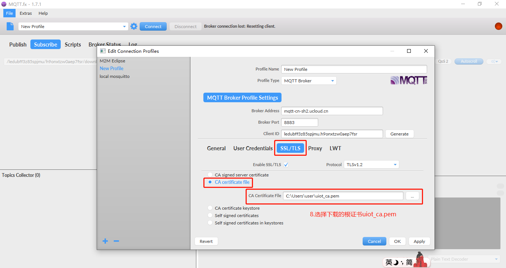
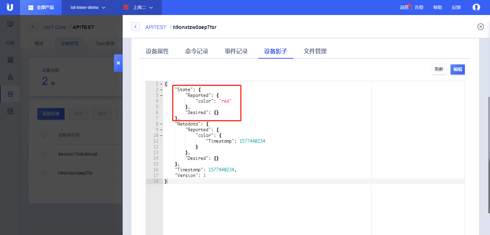
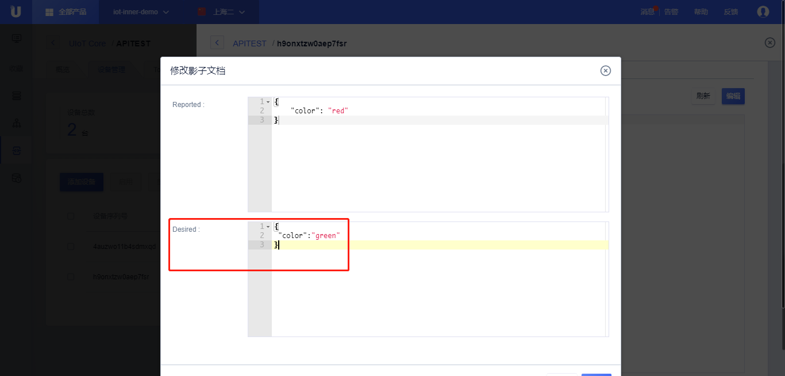
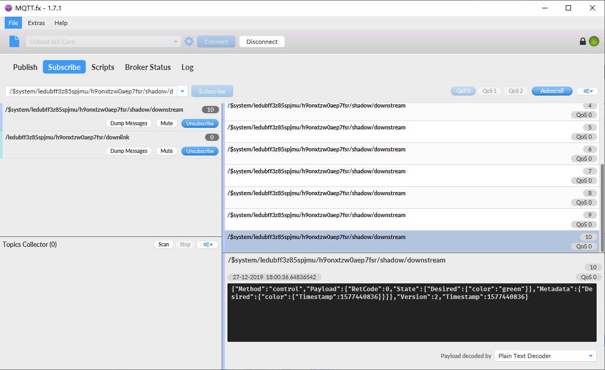
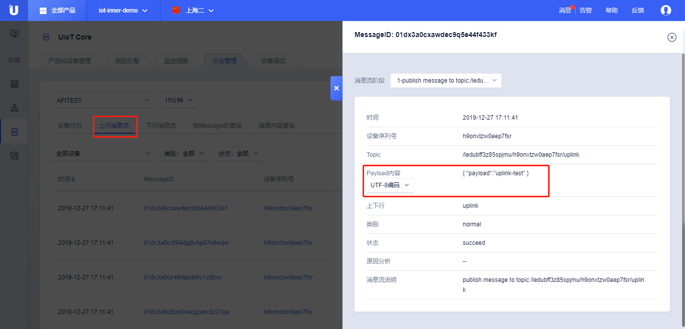
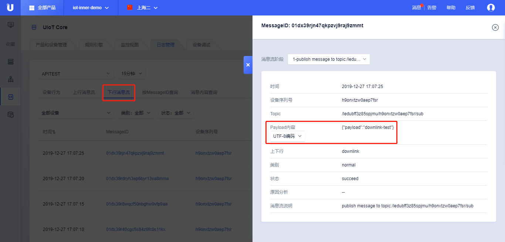

{{indexmenu_n>1}}

# 使用MQTT.fx接入物联网通信云平台	

本实践介绍一个完整的利用物联网通信云平台（UIoT-Core）实现应用程序与设备的消息上报和命令下发。

实践基于模拟客户端MQTT.fx，该软件免费使用，可以在其[官方网站下载](http://mqttfx.jensd.de/index.php/download)。

本文列举了通过设备影子和自定义Topic实现上行、下行的通信。用户也可以按照该实践完成通过物模型的上行、下行通信。

## 前提条件

1\. 参考[创建产品](../console_guide/product_device/create_products\#创建产品)、[创建设备](../console_guide/product_device/create_devcies\#创建设备)获取产品序列号、设备序列号、设备密钥：

```
ProductSN：ledubff3z85spjmu
DeviceSN：h9onxtzw0aep7fsr
DeviceSecret：6g7tjlekwf3sqqqj
```

2\. 建立连接，本例以[静态注册](	../device_develop_guide/authenticate_devices/unique-certificate-per-device_authentication\#静态注册)的方式建立连接，如需动态注册请参考[动态注册](	../device_develop_guide/authenticate_devices/unique-certificate-per-product_authentication\#动态注册)。 

1） 根据静态连接获取到MQTT登录需要的三要素：**ClientID**，**UserName**，**Password**。

|MQTT认证参数|参数值|
|---|---|
|ClientID | `ledubff3z85spjmu.h9onxtzw0aep7fsr` `规则：${ProductSN}.${DeviceSN}`|
|UserName | `ledubff3z85spjmu|h9onxtzw0aep7fsr|1` `规则：${ProductSN}\|${DeviceSN}\|${authmode}` `authmode: 1表示静态注册；2表示动态注册`|
|Password | `6g7tjlekwf3sqqqj` `规则：${DevSecret}`|

2）参考[设备连接](../device_develop_guide/connecting_devices\#设备连接)，获取MQTT Broker连接域名和TLS CA证书：

|Broker参数| 参数值|
|---|---|
|Broker Address | mqtt-cn-sh2.ucloud.cn （不同区域连接域名不同，目前仅在上海Region开放）|
|Broker Port | 1883或8883(使用TLS)|
|TLS(CA Certificate file) |[CA根证书 下载地址](http://uiot.cn-sh2.ufileos.com/uiot_ca.pem)|

3）打开MQTT.fx软件，连接成功

按照下图的顺序依次输入相应的参数值。

- 输入Broker Address、Broker Port

- 输入User Name、 Password

- 输入TLS证书，可以不使用用TLS连接，端口为1883

- 点击<Apply>，提交配置

- 点击<Connect>，进行连接


-  输入TLS证书（使用1883端口，跳过此步）：



## 通过设备影子

设备影子的具体详情参考[设备影子](../console_guide/device_shadow/operation_guide\#设备影子相关操作)，本例中设备影子的Topic为：

|Topic | 权限|描述|
|---|---|---|
|/$system/ledubff3z85spjmu/h9onxtzw0aep7fsr/shadow/upstream |发布|更新设备影子|
|/$system/ledubff3z85spjmu/h9onxtzw0aep7fsr/shadow/downstream | 订阅| 设置期望值|

### 上行测试（发送设备属性）

1\. 在MQTT.fx操作界面，点击<Publish>，输入Topic：**/$system/ledubff3z85spjmu/h9onxtzw0aep7fsr/shadow/upstream**；

2\. 根据[设备影子](../console_guide/device_shadow/operation_guide\#设备影子相关操作)文档输入Payload，上报属性**"color" : "red"**；

```
{ 
 "Method" : "update" , 
 "State" : { 
     "Reported" : { 
         "color" : "red" 
     } 
 }, 
 "Version" : 0 
}
```


3\. 在控制台查看设备影子的更新，上行数据上报成功，如图：



4\. 也可以在日志里面查看上报成功结果，如图：


### 下行测试（设置期望值）

1\. 在MQTT.fx操作界面，点击<Subscribe>，输入Topic：**/$system/ledubff3z85spjmu/h9onxtzw0aep7fsr/shadow/downstream**；


2\. 下发期望值，有两种方法： 
 
  1. 参考[设备影子](../console_guide/device_shadow/operation_guide\#设备影子相关操作)，<编辑>设备影子，输入<Desired>值：

```
{
 "color":"green"
}
```

   2. 使用云端API进行调用，参考[UpdateUIoTCoreDeviceShadow](../api_guide/deviceshadowmgmtapi)，下发需要发给设备端的期望值。  
UCloud API的调用可以通过GET或POST请求，这里以POST为例，参数中密钥、签名的使用参考[关于API接入](../api_guide/api_guidehelp)，其他参数参考[UpdateUIoTCoreDeviceShadow](../api_guide/deviceshadowmgmtapi)

```
POST  HTTP/1.1
Host: api.ucloud.cn
Content-Type: application/json
Body:
{
	"Action": "UpdateUIoTCoreDeviceShadow",
	"ProductSN": "ledubff3z85spjmu",
	"DeviceSN":"h9onxtzw0aep7fsr",
	"Desired": "eyJjb2xvciI6ImdyZWVuIn0=", //base64Encode({"color":"green"})
	"ShadowVersion": 1,
	"ProjectId": "org-z44lmf12e",
	"PublicKey": "CJf+LfjjXPk70z/fsBlK9sHC+kBTTj7gr2g/C/R7YSi3EFTK   Cmh7Bp5W1UH64D/O",
	"Region": "cn-sh2",
	"Signature": "kwe6b4r35dc41b432s2d059f602047fd51c2881z"
}
```



3\. 在MQTT.fx操作界面可以看到下发消息；



4\. 也可以在日志里面查看下发成功结果，如图：


## 通过自定义Topic

自定义Topic的具体详情参考[用户自定义Topic](../console_guide/product_device/topic)，创建上行和下行两个自定义Topic为：

|Topic | 权限|描述|
|---|---|---|
|/ledubff3z85spjmu/h9onxtzw0aep7fsr/uplink |发布|上行消息|
|/ledubff3z85spjmu/h9onxtzw0aep7fsr/downlink | 订阅| 下行消息|

### 上行测试

1\. 在MQTT.fx操作界面，点击<Publish>，输入Topic：**/ledubff3z85spjmu/h9onxtzw0aep7fsr/uplink**；

2\. 输入任意内容的Payload：

```
   {
     "payload":"uplink-test"
   }
```

3\. 在日志里面查看上报成功结果，如图：



4\. 也可以通过规则引擎M2M、HTTP、MQ等进行消息的接收消费。

### 下行测试

1\. 在MQTT.fx操作界面，点击<Subscribe>，输入Topic：**/ledubff3z85spjmu/h9onxtzw0aep7fsr/downlink**；


2\. 使用云端API进行调用，参考[PublishUIoTCoreMQTTMessage](../api_guide/messagemgmtapi)发送下行消息。

UCloud API的调用可以通过GET或POST请求，这里以POST为例，参数中密钥、签名的使用参考[关于API接入](../api_guide/api_guidehelp)，其他参数参考[PublishUIoTCoreMQTTMessage](../api_guide/messagemgmtapi)

```
POST  HTTP/1.1
Host: api.ucloud.cn
Content-Type: application/json
Body:
{
	"Action": "PublishUIoTCoreMQTTMessage",
	"ProductSN": "ledubff3z85spjmu",
	"MessageContent": "eyJwYXlsb2FkIjoiZG93bmxpbmstdGVzdCJ9", //base64Encode({"payload":"downlink-test"})
	"TopicFullName": "/ledubff3z85spjmu/h9onxtzw0aep7fsr/downlink",
	"ProjectId": "org-z44lmf12e",
	"PublicKey": "CJf+LfjjXPk70z/fsBlK9sHC+kBTTj7gr2g/C/R7YSi3EFTK   Cmh7Bp5W1UH64D/O",
	"Region": "cn-sh2",
	"Signature": "2we34r35dc41b434s2d059f642047fd51c2881f"
}
```

3\. 在MQTT.fx操作界面看到下发消息；


4\. 也可以通过日志查看下发成功结果


