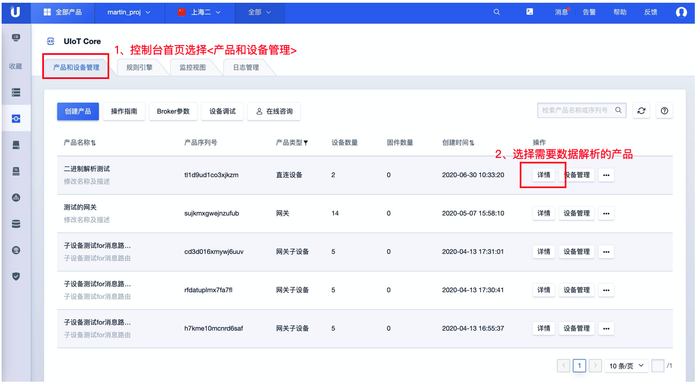
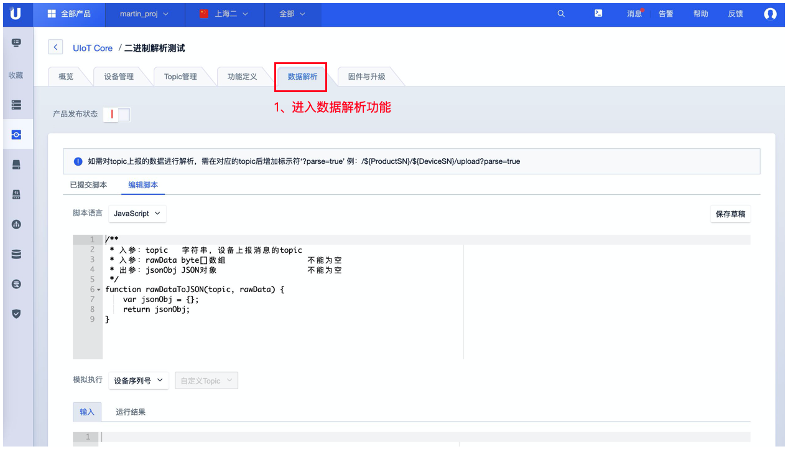

# 数据解析使用示例


## 控制台使用说明

1. [注册](https://passport.ucloud.cn/#register)UCloud云服务，如已注册请直接第2步；
2. 登录进入UCloud[物联网平台](https://console.ucloud.cn/uiot)；
3. 点击<产品和设备管理>标签；
4. 点击需要查看对应产品的<详情>；
5. 点击<数据解析>标签；
6. 点击<编辑脚本>标签进行脚本编辑，仅可在产品未发布状态下进行编辑；
7. 编辑完成后 选择<设备> <自定义Topic>进行模拟运行；
8. 运行通过后可<提交脚本>，提交脚本后即可生效对Topic数据进行解析，可在已提交脚本中查看生效的数据解析脚本。


### 流程示例如下：

**进入指定产品的数据解析功能界面录入解析脚本**




**模拟执行并提交脚本**




### 脚本示例：

```
/*
  示例数据：
  自定义Topic：
     /update，上报数据。
  输入参数：
     topic: /$productsn/$devicesn/upload
     bytes: 0x0121
  输出参数：
  {
     "temperature": 33,
     "switch": true,
     "topic": "/$productsn/$devicesn/upload"
   }
 */
function rawDataToJSON(topic, bytes) {
    var uint8Array = new Uint8Array(bytes.length);
    for (var i = 0; i < bytes.length; i++) {
        uint8Array[i] = bytes[i] & 0xff;
    }
    var dataView = new DataView(uint8Array.buffer, 0);
    var jsonObj = {};

    if(topic.includes('/error')) {
        jsonObj['topic'] = topic;
        jsonObj['retcode'] = dataView.getInt8(0)
    } else if (topic.includes('/upload')) {
        jsonObj['topic'] = topic;
        jsonObj['temperature'] = dataView.getInt8(1);
        jsonObj['switch'] = uint8Array[0] == 1 ? true: false;
    }

    return jsonObj;
}
```

1、使用时设备需要通过Topic：/$productsn/$devicesn/upload?parse=true上报数据，否则UIoT Core平台不会进行解析。

2、解析后的数据可通过规则引擎流转到其他Topic 或存入数据库等其他应用（MYSQL、MongoDB、Kafka、TSDB、PgSQL、HTTP服务、ULB）。

