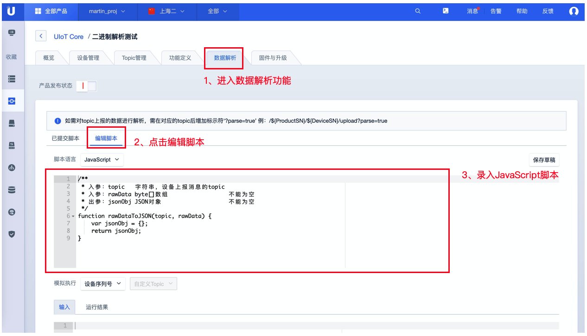
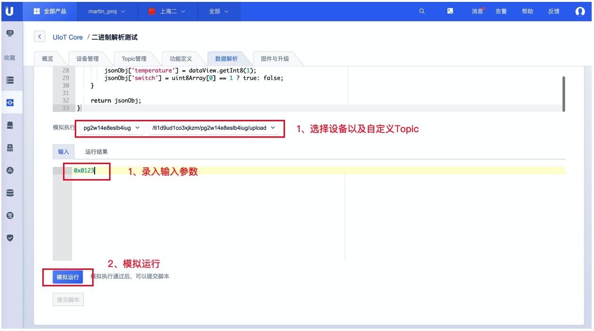
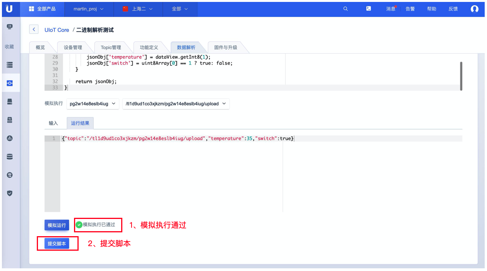
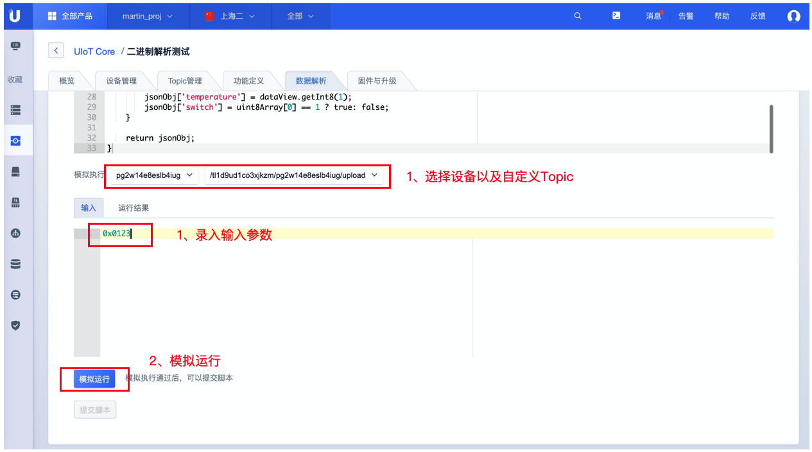
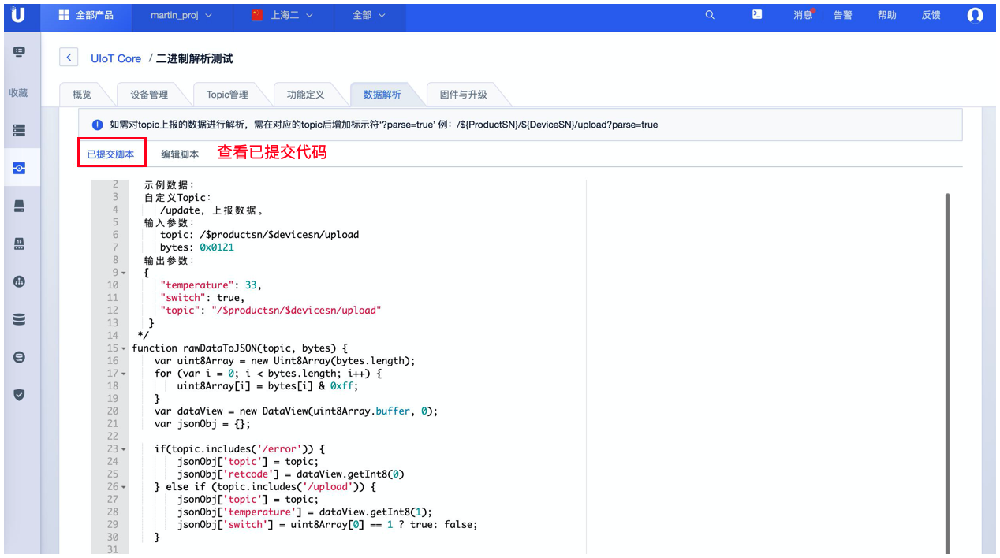

# 数据解析

## 数据解析介绍

UCloud IoT Core 标准数据格式为json。在实际项目中，存在一些硬件性能较弱的设备不适合直接使用json格式进行数据传输。UIoT Core支持此类设备直接将原数据透传到平台并提供数据解析功能针对数据进行处理。您可在控制台编辑解析脚本将原数据解析成json并使用。

## 功能原理

## 功能说明

- 以产品纬度进行数据解析，相同产品下的所有设备使用的Topic共用一套解析脚本。

- UIoT Core控制台提供解析脚本编辑，支持JavaScript。

- 使用时需在解析数据的Topic后增加标识符?parse=true 以被UIoT Core平台识别进行解析。

  例： /${ProductSN}/${DeviceSN}/upload?parse=true

- 仅支持自定义Topic的数据解析，对系统Topic无效

- 仅支持具备发布权限的Topic进行数据解析

## 控制台使用说明

1. [注册](https://passport.ucloud.cn/#register)UCloud云服务，如已注册请直接第2步；
2. 登录进入UCloud[物联网平台](https://console.ucloud.cn/uiot)；
3. 点击<产品和设备管理>标签；
4. 点击需要查看对应产品的<详情>；
5. 点击<数据解析>标签；
6. 点击<编辑脚本>标签进行脚本编辑，仅可在产品未发布状态下进行编辑；
7. 编辑完成后 选择<设备> <自定义Topic>进行模拟运行；
8. 运行通过后可<提交脚本>，提交脚本后即可生效对Topic数据进行解析，可在已提交脚本中查看生效的数据解析脚本。

### 流程示例如下：

**选择需要进行数据解析的产品**

**进入数据解析功能界面**

**编辑数据解析脚本**

**模拟执行**

**提交脚本**

**查看已提交代码**

