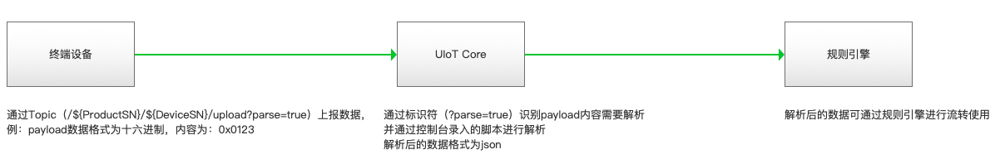

# 数据解析

UCloud IoT Core 标准数据格式为json。在实际项目中，存在一些硬件性能较弱的设备不适合直接使用json格式进行数据传输。UIoT Core支持此类设备直接将原数据透传到平台并提供数据解析功能针对数据进行处理。您可在控制台编辑解析脚本将原数据解析成json并使用。

## 功能原理

- 终端设备在上报数据时，通过在发布的topic后增加标识符?parse=true，以便UIoT Core平台识别此Topic数据需解析。
- UIoT Core平台会执行用户预先上传的解析脚本将原数据进行转换输出的格式为json。
- 可通过规则引擎将转换的数据流转到其他Topic中或数据库中

## 功能说明

- 以产品纬度进行数据解析，相同产品下的所有设备使用的Topic共用一套解析脚本。

- UIoT Core控制台提供解析脚本编辑，支持JavaScript。

- 使用时需在解析数据的Topic后增加标识符?parse=true 以被UIoT Core平台识别进行解析。

  例： /${ProductSN}/${DeviceSN}/upload?parse=true

- 仅支持自定义Topic的数据解析，对系统Topic无效

- 仅支持具备发布权限的Topic进行数据解析

