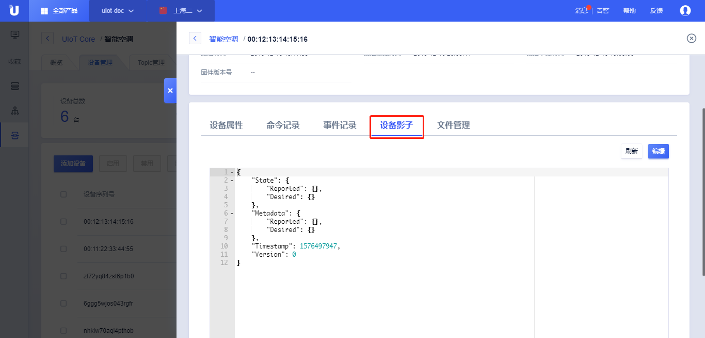

{{indexmenu_n>1}}


# 设备影子简介

设备影子可以理解为是设备在云端的属性缓存。设备上报其属性值到设备影子中，应用服务可以通过设备影子直接获取设备的最后一次更新的属性值，而无需每次访问设备。

设备影子作用：

- 云端应用可以直接获取设备的属性而无需关心设备是否在线；

- 云端应用可以随时下发控制指令给设备，而无需关心设备是否在线。当设备在线时，平台会将设置值推送给设备；如果设备不在线，云端会在设备上线的第一时间将设置的值推送给设备。


## 设备影子的格式

设备影子示例：
```
{
  "State": {
    "Reported": {
      "humidity": 16,
      "smoke": 10.5,
      "temperature": 27
    },
    "Desired": {
      "humidity": 70
    }
  },
  "Metadata": {
    "Reported": {
      "humidity": {
        "Timestamp": 1557222636
      },
      "smoke": {
        "Timestamp": 1557222636
      },
      "temperature": {
        "Timestamp": 1557222636
      }
    },
    "Desired": {
      "humidity": {
        "Timestamp": 1557222800
      }
    }
  },
  "Timestamp": 1557222700,
  "Version": 3
}
```

设备影子的组成：

- **State** 设备的属性值
  - **Reported**  记录设备上报的属性值。具体包含哪些值，由设备自行决定。如果设备不上报，则Reported部分为空。
  - **Desired**   云端应用设置设备期望值。
- **Metadata** 元数据中包含的属性字段和State中是一致的，记录的是各个属性更新的时间。
  - **Timestamp** 属性的更新时间，为Unix时间戳。
- **Timestamp**  设备影子最新更新的时间。
- **Version**   设备影子的版本号，设备影子的更新需要遵循一定的规则，具体参考[设备影子相关操作](operation_guide)。


## 设备影子查看与更新

1. [注册](https://passport.ucloud.cn/#register)UCloud云服务，如已注册请直接第2步；
2. 登录进入UCloud[物联网平台](https://console.ucloud.cn/iot)；
3. 点击<产品和设备管理>标签；
4. 点击需要查看对应产品的<详情>；
5. 点击<设备管理>标签；
6. 点击需要查看的对应设备的<详情>；
7. 点击<设备影子>，可以查看到设备影子文档；
8. 点击<刷新>可以查看最新的影子文档内容；
9. 点击<编辑>可以对设备设置属性期望值，并保存在Desired中；



