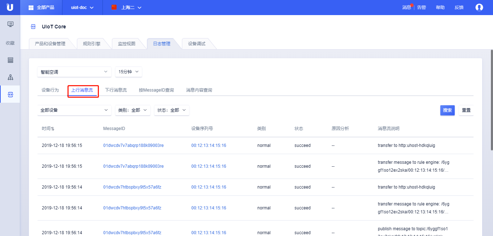
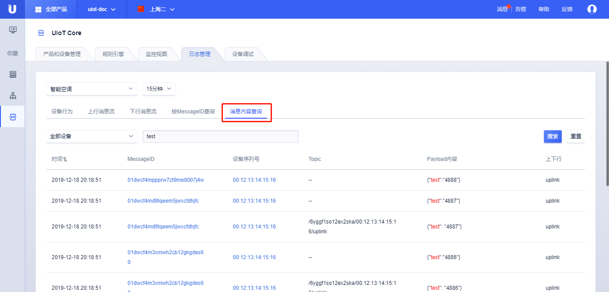

{{indexmenu_n>3}}

# 日志管理

物联网平台提供接入平台的设备日志查询和管理功能，可以方便的查询并了解设备的历史行为，日志管理功能包括

- [设备行为日志](#设备行为日志)；

- [上行消息流日志](#上行消息流日志)；

- [下行消息流日志](#下行消息流日志)；

- [根据MessageID查询日志](#按MessageID查询)

- [根据消息内容查询日志](#消息内容查询日志)；

日志管理的使用说明：

- 日志查询需要先指定产品；

- 日志自动刷新可能会出现1-2秒的延时，或者可以主动刷新；

- 日志可以查询15分钟、1小时、4小时、24小时、7天不同时间范围的日志，也可以自定义查询范围，自定义最小窗口是15分钟，最大窗口是1个月；

- 日志最长保存时间是3个月；

## 设备行为日志

设备行为消息日志：

- 日志支持筛选字段：

  - 设备序列号

- 日志包含字段：

  - 时间：消息发生的时间；

  - 设备序列号：这条日志相关的设备；

  - 行为：

    - 设备上线

    - 设备下线

    - 设备订阅Topic

    - 设备取消订阅Topic；

  - 状态：表示设备行为执行的最终状态，success/fail；

  - 原因分析：

    - 设备上线成功；

    - 设备上线失败：未授权；

    - 设备下线：同clientid设备竞争/设备在控制台被删除/设备在控制台被禁用/设备主动发送disconnect请求

    - 设备订阅成功；

    - 设备订阅失败： 未授权；

    - 设备取消订阅成功；

## 上行消息流日志

上行消息日志：
- 上行消息日志包括：

  - 设备发送消息到topic，消息流转到规则引擎和规则引擎转发消息到UCloud其他产品；

  - 设备发送消息到topic, 消息流转到设备影子；

- 日志包含筛选字段：

  - 设备序列号；

  - 类别：设备影子、常规、OTA升级、物模型属性、物模型事件、物模型命令；

  - 状态：succeed/fail；

- 日志包含字段：

  - 时间：消息发生的时间；

  - MessageID： MessageID是某条消息在平台流转的唯一标识，通过Message  ID可以查询设备在平台流转的路径，比如经过设备影子，或者经过规则引擎；

  - 设备序列号：设备的序列号；

  - 类别：消息的类型，可以筛选设备影子、常规、OTA升级、物模型属性、物模型事件、物模型命令等；

  - 状态：succeed/fail；

  - 原因分析：

    - 设备发送消息到topic成功；

    - 设备发送消息到topic失败： 未授权；

    - 消息流转到ruleengine成功；

    - 消息流转到ruleengine失败： 系统错误；

    - 消息流转到kafka成功；

    - 消息流转到Kafka失败： Kafka服务异常/系统错误；

    - 消息流转到Mongo成功；

    - 消息流转到Mongo失败：参数异常/Mongo服务异常/系统错误；

    - 消息流转到topic成功；

    - 消息流转到topic失败： 参数异常/系统异常；

    - 设备修改设备影子成功；

    - 设备修改设备影子失败： 参数异常/影子文档版本冲突/不正确的json格式/设备影子功能未开启/系统错误

  - 消息流说明：该消息具体的流转路径；

## 下行消息流日志

下行消息日志：

- 下行消息日志包括：

  - 云端应用程序发送修改设备影子请求到设备影子，设备影子转发请求到设备；

  - 规则引擎转发消息到设备

- 日志包含筛选字段：

  - 设备序列号；

  - 类别：设备影子、常规、OTA升级、物模型属性、物模型事件、物模型命令；

  - 状态：succeed/fail；

- 日志包含字段：

  - 时间：消息发生的时间；

  - MessageID： MessageID是某条消息在平台流转的唯一标识，通过Message  ID可以查询设备在平台流转的路径，比如经过设备影子，或者经过规则引擎；

  - 设备序列号：设备的序列号；

  - 类别：消息的类型，可以筛选设备影子、常规、OTA升级、物模型属性、物模型事件、物模型命令等；

  - 状态：succeed/fail；

  - 原因分析： 

    - 云端APP发送修改影子请求成功；

    - 云端APP发送修改影子请求失败： 设备影子服务异常/API调用参数异常/设备影子功能未开启/影子版本冲突；

    - 设备影子转发请求到设备成功；

    - 设备影子转发请求到设备失败： 设备离线/系统错误；

    - 规则引擎转发消息到设备成功；

    - 规则引擎转发消息到设备失败： 设备离线/系统错误；

  - 消息流说明：该消息具体的流转路径；

## 按MessageID查询日志

根据MessageID查询：

- 按MessageID查询可以直接根据MessageID查询指定时间范围内的消息；

- 日志搜索字段：

  - 按MessageID：按照MessageID搜索某条消息在平台内部的流转过程；

- 日志包含字段：

  - 时间：消息发生的时间；

  - MessageID： MessageID是某条消息在平台流转的唯一标识，通过Message  ID可以查询设备在平台流转的路径，比如经过设备影子，或者经过规则引擎；
  
  - 设备序列号：发送该条消息的设备的序列号；

  - Topic：消息上行或下行承载的Topic；

  - Payload内容：消息体内的原始内容；

  - 上下行：表征是上行消息还是下行消息；
  
  - 类别：消息的类型，可以筛选设备影子、常规、OTA升级、物模型属性、物模型事件、物模型命令等；
  
  - 状态：succeed/fail；
  
  - 原因分析： 

    - 云端APP发送修改影子请求成功；

    - 云端APP发送修改影子请求失败： 设备影子服务异常/API调用参数异常/设备影子功能未开启/影子版本冲突；

    - 设备影子转发请求到设备成功；

    - 设备影子转发请求到设备失败： 设备离线/系统错误；

    - 规则引擎转发消息到设备成功；

    - 规则引擎转发消息到设备失败： 设备离线/系统错误；

  - 消息流说明：该消息具体的流转路径；

## 消息内容查询日志

根据消息内容查询：

- 消息内容查询可以根据筛选条件查询指定时间范围内的消息；

- 日志包含筛选字段：

  - 选择设备：查询某个设备，或者全部设备；

  - 按MessageID：按照MessageID搜索某条消息在平台内部的流转过程；

- 日志包含字段：

  - 时间：消息发生的时间；

  - MessageID： MessageID是某条消息在平台流转的唯一标识，通过Message  ID可以查询设备在平台流转的路径，比如经过设备影子，或者经过规则引擎

  - 设备序列号：发送该条消息的设备的序列号；

  - Topic：消息上行或下行承载的Topic；

  - Payload内容：消息体内的原始内容；

  - 上下行：表征是上行消息还是下行消息；

