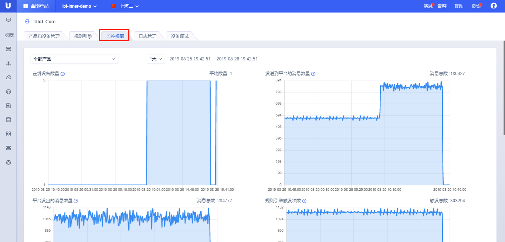

# 监控视图

监控视图包括5个方面的监控：

- 在线设备数量：是指与平台建立连接的数量，数据显示的是某个采样周期内的在线设备平均值；

- 发送到平台的消息数量：上行消息数，数据显示的是某个采样周期内的消息的累加值；

- 平台发出的消息数量：下行消息数，数据显示的是某个采样周期内的消息的累加值；

- 规则引擎触发次数：规则引擎被触发的次数，数据显示的是某个采样周期内的触发次数累加值；

- 规则引擎转发次数：规则引擎被转发的次数，与触发次数的区别在于某个规则下可能含有多个规则，则被认为转发了多次，数据显示的是某个采样周期的转发累加值；

监控视图的说明：

- 监控视图可以查看全部产品或某个产品；

- 监控视图可以查看1小时、1天、7天、15天不同颗粒度的统计信息，也可以自定义，自定义最小窗口是1小时，最大窗口是1个月；

- 监控事件最长保存时间是3个月；

