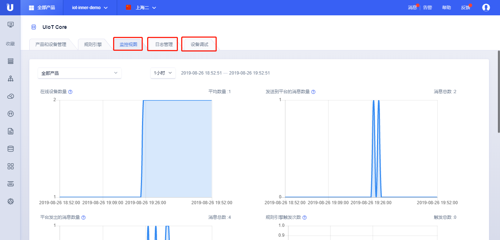

{{indexmenu_n>1}}

# 概述

监控日志与调试包括三个功能：

监控展示了设备和消息的一些统计值；

日志提供了设备行为、上行消息流、下行消息流、消息内容的查询。

调试功能提供云端对设备的调试功能，调试功能基于物模型，可以对属性设置及命令下发，查看云端和设备报文交互。

## 操作步骤

1. [注册](https://passport.ucloud.cn/#register)UCloud云服务，如已注册请直接第2步；

2. 登录进入UCloud[物联网平台](https://console.ucloud.cn/uiot)；

3. 点击<设备监控与调试>标签；

4. 查看<监控视图>，查看<日志管理>，查看<设备调试>；

