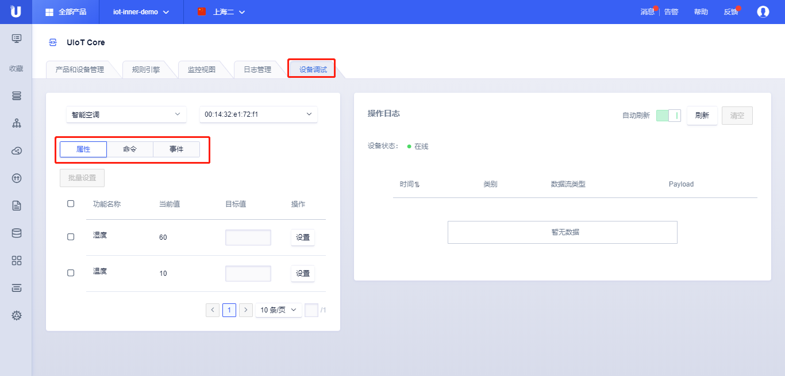
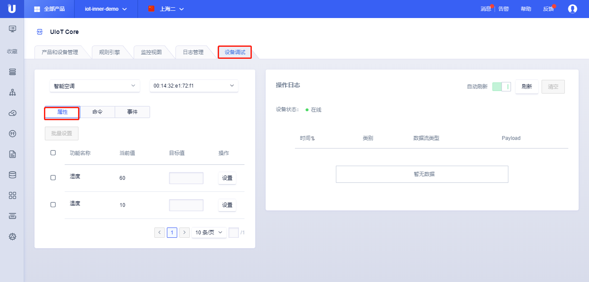
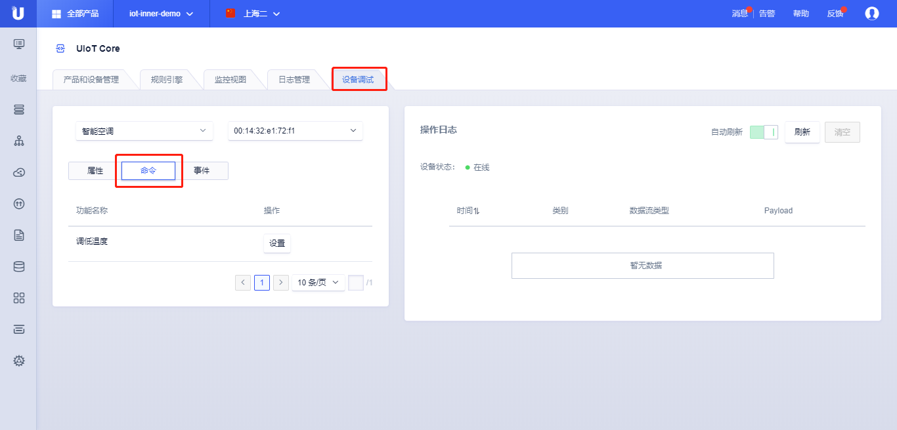
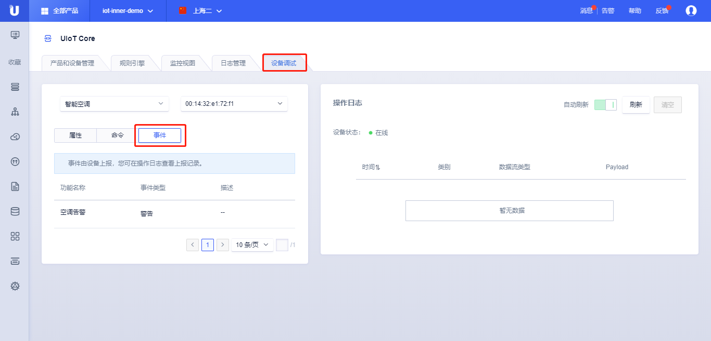

# 设备调试

设备调试提供云端对设备的调试功能，调试功能基于物模型，可以对属性设置及命令下发，查看云端与设备的交互。设备调试可以帮助用户快速诊断在线设备收发消息是否正常。

设备调试是针对某个特定的真实设备进行调试，设备离线时无法进行设备调试。

## 操作步骤

1. 选择需要调试的<产品名称>，选择需要调试的<设备序列号>;

2. 选择属性、命令、事件；

3. 设置属性或下发命令（异步）；

4. 查看日志；

## 属性设置

属性设置功能：

- 功能名称：物模型定义的属性；

- 当前值：设备上报的属性值；

- 目标值：期望设置的属性值；

- 操作：点击<设置>按钮，表示下发消息；

- 批量设置：批量设置会将所选择的属性合并在一个JSON里面进行下发；

操作日志：

- 刷新：可以点击<刷新按钮>进行主动刷新，或者打开自动刷新按钮，每5秒钟刷新一次；

- 清空：清空当前日志数据；

- 设备状态：在线或离线；

- 日志内容：

   - 时间：日志消息产生的时间；

   - 类别：

   - 数据流内容：

   - Payload：设置的数据JSON包；

## 命令下发

下发控制命令，该调试采用异步调用：

- 功能名称：物模型定义的命令；

- 操作：点击<设置>按钮，会弹出功能设置对话框，指定输入参数；

  - 功能设置：给定输入参数参数值；

操作日志：

- 刷新：可以点击<刷新按钮>进行主动刷新，或者打开自动刷新按钮，每5秒钟刷新一次；

- 清空：清空当前日志数据；

- 设备状态：在线或离线；

- 日志内容：

   - 时间：日志消息产生的时间；

   - 类别：

   - 数据流内容：

   - Payload：设置的数据JSON包；

## 事件上报

事件上报为只读，所以无法做调试，但是可以通过操作日志查看上报内容。

操作日志：

- 刷新：可以点击<刷新按钮>进行主动刷新，或者打开自动刷新按钮，每5秒钟刷新一次；

- 清空：清空当前日志数据；

- 设备状态：在线或离线；

- 日志内容：

   - 时间：日志消息产生的时间；

   - 类别：

   - 数据流内容：

   - Payload：设置的数据JSON包；

