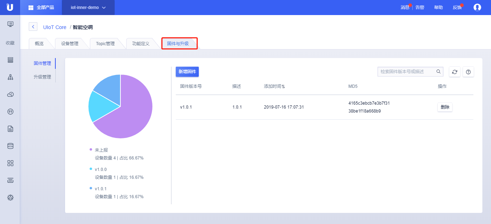
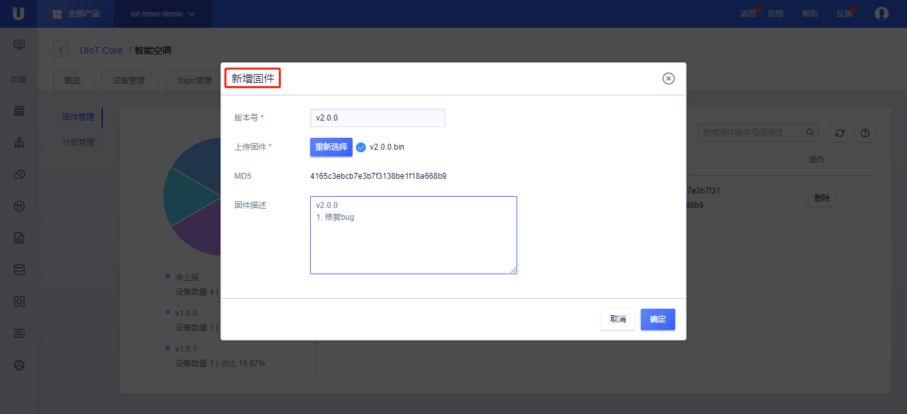

{{indexmenu_n>2}}

# 固件与升级

## 操作步骤
1. [注册](https://passport.ucloud.cn/#register)UCloud云服务，如已注册请直接第2步；
2. 登录进入UCloud[物联网平台](https://console.ucloud.cn/iot)；
3. 点击<产品和设备管理>标签；
4. 点击需要升级产品进入产品详情页；
5. 选择<固件与升级>；

## 固件管理
固件管理可以查看所有设备的版本的分布情况和新增固件。

### 新增固件
1. 点击<固件管理>，然后点击<新增固件>;
2. 新增固件：
   - 版本号（必填）：输入版本号，由1-32位英文字母、数字、点、中划线和下划线组成；
   - 选择文件（必填）：上传固件文件，成功后会显示文件的MD5值；目前文件大小限制最大为10M；
   - 固件描述：填写对该固件的描述，比如固件更新内容等，最长100个字符，无特殊字符限制；
3. 点击<确定>，新增固件成功；

