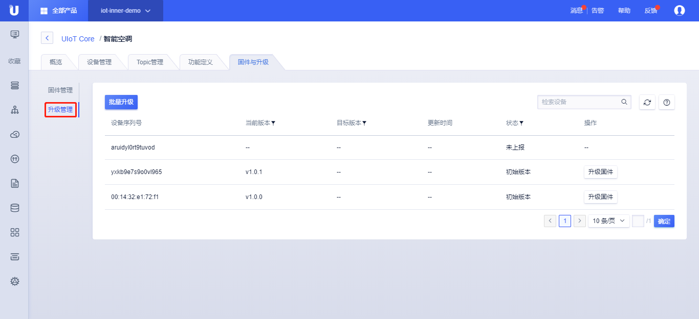
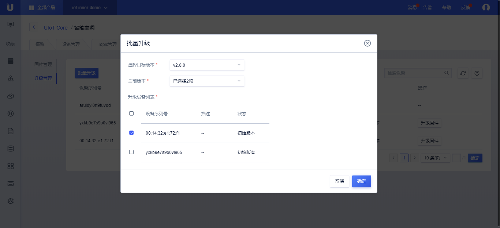

# 升级管理

升级管理会列出所有当前产品下的所有设备，并列出设备的：

- 设备序列号；

- 当前版本：当前版本由设备上报，只有上报过版本的才可以进行固件升级；上报版本可以参考[设备OTA升级](../../device_develop_guide/ota)；

- 选择目标版本：表示待升级设备的目标版本；

- 更新时间：最后一次设备上报的升级状态；

- 状态：设备升级的状态，共有7个状态，具体流程参考[设备OTA升级](../../device_develop_guide/ota)：

  - 未上报：当前设备未上报版本号；

  - 初始版本：当前设备第一次上报版本号，尚未升级；

  - 待升级：平台给设备下发了固件升级消息，但设备没有上报下载进度；

  - 下载中：设备上报了下载进去但是没有上报升级进度；

  - 升级中：设备上报了升级进度；

  - 升级成功：设备上报升级成功；

  - 升级失败：设备上报升级失败；

- 操作：对设备进行操作，共有两个操作"重试"和"升级固件"；

  - 重试：升级失败或者长时间升级中，可以点击重试进行重新下发升级信息；

  - 升级固件：下发固件升级信息到设备，进入升级中的状态；

- 升级管理可以对当前版本、目标版本、状态进行筛选；

## 批量升级

批量升级可以同时将多个不同的版本的设备升级到一个目标版本。

1. 点击<升级管理>；

2. 点击<批量升级>；

   - 选择目标版本：选择准备升级到的目标版本；

   - 当前版本：筛选需要升级的当前版本，支持多选；

   - 升级设备列表：选择当前版本后，还可以更细颗粒度的选择需要升级的设备；

3. 点击<确定>，查看升级设备列表变为“待升级”状态；

4. 等待升级完成；

5. 查看设备升级状态，未上报/初始版本/待升级/下载中/升级中/升级成功/升级失败，参考[设备OTA升级](../../device_develop_guide/ota)；

## 固件升级注意事项

1. 新增固件上传大小最大为10M；

2. 目前支持固件上传最多数量为10个；

3. 固件上传支持文件类型限为：bin, tar, gz, zip；

4. 同一产品下固件版本号需唯一，仅支持英文字母、数字、点、中划线和下划线，长度限制1-32个字符；

5. 固件描述最长为100个字符，无特殊字符限制；