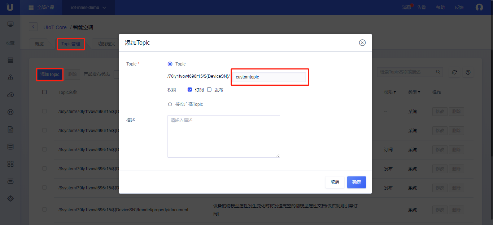
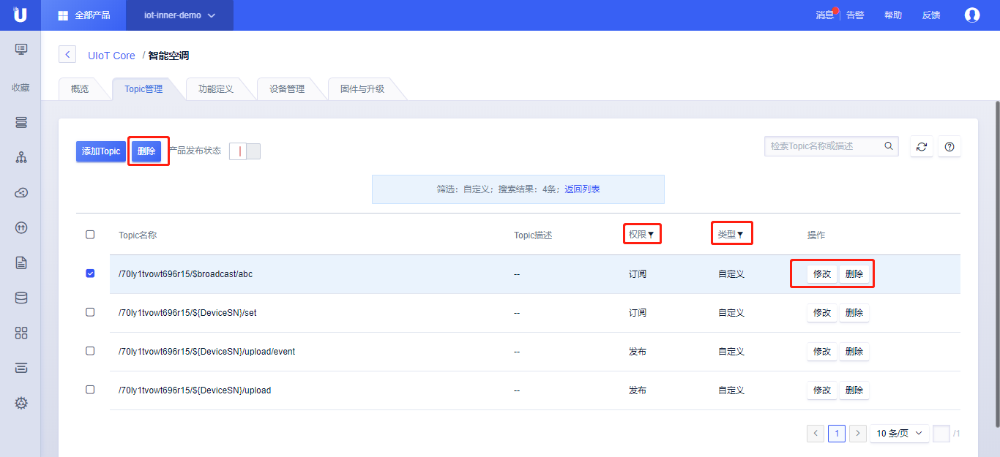
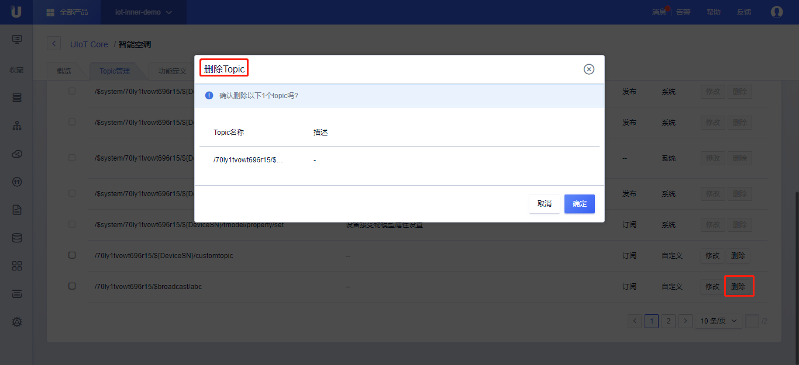

{{indexmenu_n>3}}
# Topic管理
Topic或主题是物联网平台的核心概念，也是一切消息流转的载体，平台为每个产品提供了一些默认的系统Topic，同时用户也可以针对各自的产品自定义自己的Topic，为Topic指定相应的权限。

Topic是跟随着产品一起定义的，在定义Topic时，路径中会使用`${DeviceSN}`标识具体设备，当该设备发布或订阅该Topic时，使用该设备的`设备序列号`来替换即可。

比如：
1. 定义某个产品的Topic为：`/70ly1tvowt696r15/${DeviceSN}/download`，具有订阅权限；
2. 某个设备的`设备序列号`为`pcur1q7jm2lb57rk`，则该设备订阅时使用Topic：`/70ly1tvowt696r15/pcur1q7jm2lb57rk/download`；

关于Topic的一些限制：   

- Topic不可以跨越产品进行发布或者订阅；
- Topic命名以正斜线`/`做层级处理，`${ProductSN}`为抽象层级，表示`产品序列号`；`${DeviceSN}`为抽象层级，表示`设备序列号`；`$broadcast`为抽象层级，表示某个产品下的所有`设备序列号`；
- 自定义Topic的命名以`/`分割，每层可包含字母、数字、`-`、`_`、`@`、`:`、`+`、`#`，长度限制64，最多支持5层。`+`和`#`仅用于订阅权限Topic，`#`只能放在结尾；
- Topic的权限可以设置为发布、订阅、同时支持发布和订阅；
- Topic用于规则引擎筛选时，支持MQTT默认的通配符`+`，`#`，参考[Topic通配符]()；

注：文档中`${variable}`代表一个变量，`$system`代表实际`$`为其组成部分。

## 系统Topic
系统Topic是指系统预定义的有特殊用途的Topic，比如操作[设备影子]()、操作[物模型]()、操作设备状态、操作[固件升级]()，具体概念可以参考对应章节。

系统Topic会在第一层级以`/$system`开始。

|Topic| 权限|描述|
|---|---|---|
|/$system/${ProductSN}/${DeviceSN}/device/status|订阅|设备状态|
|/$system/${ProductSN}/${DeviceSN}/shadow/upstream |发布|上行操作设备影子（更新、删除）|
|/$system/${ProductSN}/${DeviceSN}/shadow/downstream | 订阅| 设置期望值|
|/$system/${ProductSN}/${DeviceSN}/shadow/get|发布|获取设备影子|
|/$system/${ProductSN}/${DeviceSN}/shadow/get_reply|订阅|获取设备影子返回|
|/$system/${ProductSN}/${DeviceSN}/shadow/document|-|设备影子发生变化时将发送完整的设备影子文档(仅用于规则引擎)|
|/$system/${ProductSN}/${DeviceSN}/tmodel/template/get|发布|请求获取物模型功能定义JSON描述|
|/$system/${ProductSN}/${DeviceSN}/tmodel/template/get_reply | 订阅| 返回物模型功能定义JSON描述|
|/$system/${productSN}/${DeviceSN}/tmodel/property/post|发布|上报属性|
|/$system/${productSN}/${DeviceSN}/tmodel/property/post_reply|订阅|云平台对设备属性的响应|
|/$system/${productSN}/${DeviceSN}/tmodel/property/set|订阅|云平台设置属性|
|/$system/${productSN}/${DeviceSN}/tmodel/property/set_reply|发布|设备端对设置属性的响应|
|/$system/${productSN}/${DeviceSN}/tmodel/property/restore|发布|请求恢复属性|
|/$system/${productSN}/${DeviceSN}/tmodel/property/restore_reply|订阅|云平台返回需要恢复的属性值|
|/$system/${productSN}/${DeviceSN}/tmodel/property/desired/get|发布|获取期望属性|
|/$system/${productSN}/${DeviceSN}/tmodel/property/desired/get_reply|订阅|云平台返回期望属性|
|/$system/${productSN}/${DeviceSN}/tmodel/property/desired/delete|发布|删除期望属性|
|/$system/${productSN}/${DeviceSN}/tmodel/property/desired/delete_reply|订阅|云平台返回删除结果|
|/$system/${productSN}/${DeviceSN}/tmodel/property/document|-|设备的物模型属性发生变化时将发送完整的物模型属性文档(仅用于规则引擎)|
|/$system/${productSN}/${DeviceSN}/tmodel/event/post|发布|上报事件|
|/$system/${productSN}/${DeviceSN}/tmodel/event/post_reply|订阅|云平台对上报事件的响应|
|/$system/${productSN}/${DeviceSN}/tmodel/command|订阅|云平台下发命令|
|/$system/${productSN}/${DeviceSN}/tmodel/command_reply/${requestid}|发布|设备端对云平台下发命令的响应|
|/$system/${productSN}/${deviceSN}/ota/upstream|发布|设备上报固件版本升级状态|
|/$system/${productSN}/${deviceSN}/ota/downstream|订阅|云端下发固件升级消息|

## 用户自定义Topic

用户可以通过<Topic管理>添加自定义Topic，并指定这些Topic的发布或订阅权限。

### 操作步骤
1. [注册](https://passport.ucloud.cn/#register)UCloud云服务，如已注册请直接第2步；
2. 登录进入UCloud[物联网平台](https://console.ucloud.cn/iot)；
3. 选择<产品和设备管理>标签；
4. 选中需要定义Topic的产品，进入产品详情页；
5. 点击<Topic管理>标签，点击<添加Topic>，添加Topic；
6. - 设置Topic类：
     - 输入Topic的剩余层级内容，剩余部分以`/`分割，每层可包含字母、数字、`-`、`_`、`@`、`:`、`+`、`#`，长度限制64，最多支持5层。`+`和`#`仅用于订阅权限Topic，`#`只能放在结尾；
     - 选择Topic权限，发布或者订阅；
     - 输入描述，限制为0-100字符，无特殊符号限制；
     - 单击<确定>，创建成功；
   - 设置<接收广播Topic>
     - 输入Topic的剩余层级内容，剩余部分以`/`分割，每层可包含字母、数字、`-`、`_`、`@`、`:`、`+`、`#`，长度限制64，最多支持5层。`#`只能放在结尾；
     - 输入描述，限制为0-100字符，无特殊符号限制；
     - 单击<确定>，创建成功；
7. 自定义Topic添加完成后
   - 修改：点击<修改>，修改Topic内容；
   - 删除：点击<删除>，删除该Topic，参考[Topic删除]()；
   - 批量删除：多选后，批量<删除>自定义Topic；
   - 产品发布状态：打开后表示产品为已发布状态，已发布产品无法修改Topic和物模型；
   - 可以对Topic权限或类型进行筛选；

### Topic删除

1. 接上述操作步骤，仍然在<Topic管理>标签；
2. 点击<删除>，点击<确定>，删除成功；

自定义Topic删除注意事项：
- 删除具有发布权限的Topic，平台将不再接收该Topic的数据；
- 删除具有订阅权限的Topic，设备将无法订阅该Topic，已经订阅的设备将不再能收到数据；
- 自定义Topic删除后，规则引擎的Topic需要自行删除，规则引擎不做Topic的有效性的校验；

### 广播Topic

广播Topic是指某个产品公用的Topic，只具有订阅权限，所有该产品下的设备均可以订阅该Topic。云应用可以通过API发送数据到该Topic，所有订阅了该Topic的设备都会收到该数据。

广播Topic的格式为`/${ProductSN}/$broadcast/xxxxx`

## Topic通配符
设备可以订阅含有通配符的Topic，规则引擎的消息筛选Topic设置中，可以使用通配符。

|通配符 |	描述|
|---|---|
|# | 这个通配符必须出现在Topic的最后一个层级，代表本级及下级所有类目。 例如， Topic /70ly1tvowt696r15/pcur1q7jm2lb57rk/upload/#中，/upload层级后使用通配符#，代表/upload层级后的所有层级。该Topic可以代表/70ly1tvowt696r15/pcur1q7jm2lb57rk/upload/data和/70ly1tvowt696r15/pcur1q7jm2lb57rk/upload//error。 |
|+ | 代表本级所有符合的。 例如，Topic /70ly1tvowt696r15/+/upload中，代表产品下所有设备，可以代表/70ly1tvowt696r15/deviceA/upload和/70ly1tvowt696r15/deviceB/upload。|
