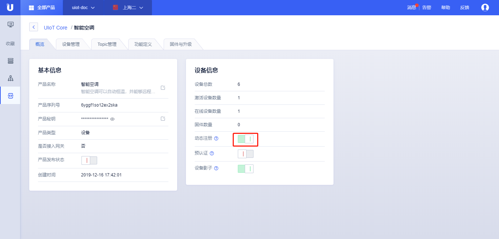
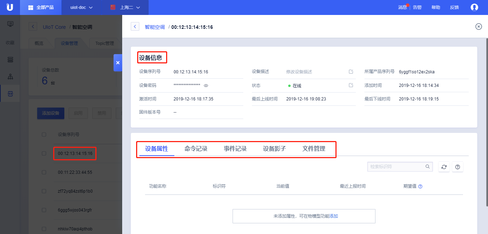

{{indexmenu_n>2}}

# 创建设备

## 创建单个或多个设备

产品创建完成后，我们可以创建属于该产品的单个设备，也可以批量创建多个设备，本节先介绍如何创建单个设备。

### 操作步骤

1. [注册](https://passport.ucloud.cn/#register)UCloud云服务，如已注册请直接第2步；

2. 登录进入UCloud[物联网平台](https://console.ucloud.cn/iot)；

3. 选择<产品和设备管理>标签；

4. 单击需要创建设备的产品，进入产品详情页；

5. 点击<设备管理>标签；

6. 点击<添加设备>；

7. 添加设备有两种方式：

   - 随机生成

     1. 设置<生成设备个数>，单次最多可以生成1000个设备；
	 
     2. 点击<确定>，系统会自动生成指定数量的设备，**设备序列号**和**设备密码**为随机生成该产品下唯一的16位字符串；

   - 手动输入

     1. 手动输入设备序列号，添加多个可以通过<回车/换行符>隔开，单次最多可以批量添加1000个设备；
	 
     2.  手动输入设备序列号长度为4-64个字符，可包含英文字母、数字和连接号"-"、下划线"_"、"@"、英文冒号":"；
	 
     3. 点击<确定>，系统会生成指定**设备序列号**的设备，以及**设备密码**；

8. **设备序列号**和**设备密码**是[设备注册](../../device_develop_guide/authenticate_devices/what_is_authenticate_devices.md)到平台的重要凭证，需要妥善保存；

9. 设备创建成功后，可以在设备列表页

   - <设备总数>、<激活设备>、<在线设备数量>可以查看设备统计信息；
   
   - 点击<获取未激活设备密码>，可以以csv的格式导出所有未激活的设备的**设备序列号**和**设备密码**。
   
   - 批量<启用>、<禁止>、<删除>设备；
   
   - 通过<设备序列号>或<设备描述>检索设备；
   
   - 点击<设备序列号>或<详情>，进入[设备详情](create_devcies\#设备详情)页；[设备详情](create_devcies.md#设备详情)[设备详情](create_devcies.md\#设备详情)
   [设备详情](create_devcies#设备详情)
   
   - 点击<禁用>则[禁用设备]()；
   
   - 点击<设备调试>，进入[设备调试]()页；
   
   - 点击<删除>，进入[设备删除]()页；

## 动态注册设备

动态注册设备是指产品下的所有设备通过产品序列号和产品密码进行设备注册，从而实现了一个型号只需要一个密码。

动态注册设备需要产品开启[动态注册]()开关。

为了防止产品密码泄露后非授权设备登录到平台，动态注册设备需要先通过[手动输入]()预登记设备序列号，设备出厂后首次接入到平台时需要进行匹配，成功后方可接入平台。

动态注册设备的具体流程可以参考[设备端开发指南-动态注册]()。

## 管理设备
设备添加之后可以对设备进行查看、管理、禁用。

### 设备详情
依次点击<设备管理>标签，找到需要查看的设备，点击该设备<设备序列号>或<详情>，则进入了设备详情页。

**设备详情页：**

- 基本信息

   - 设备序列号：设备的序列号，自动生成，或者手动输入；
   
   - 设备描述：对该设备的具体描述；
   
   - 所属产品序列号：该设备所属产品的序列号；
   
   - 设备密码：设备接入平台的许可密码，每个设备都有唯一的许可密码，动态注册的设备会在动态注册时下发该设备密码；
   
   - 状态：设备当前的状态，包括未激活、离线、在线、已禁用等状态；
   
   - 添加时间：该设备添加的时间；
   
   - 激活时间：该设备激活的时间，平台把第一次上线时间认为是激活时间；
   
   - 最后上线时间：最后一次上线的时间；
   
   - 最后下线时间：最后一次下线的时间；
   
   - 固件版本号：当前设备的固件版本号，如果没有上报则显示"-"；

- 物模型属性、命令、事件

   - 设备属性：记录设备上报的属性值以及期望设置的属性值，详细参考[功能定义(物模型)]；
   
   - 命令记录：记录云端向设备端下发的命令的记录，详细参考[功能定义(物模型)]；
   
   - 事件记录：记录设备端上报事件的记录，详细参考[功能定义(物模型)]；
   
- 设备影子

   - 影子文档是一个Json文件，设备可以更新设备影子，操作台也可以通过编辑设备的期望值下发设置给设备，详细参考[设备影子]()；

### 设备禁用

控制台可以通过设备管理页的<禁用>按钮对设备进行封禁处理，被封禁后的设备将不能接入平台，在线设备将会强制下线。

设备禁用后可以通过<启用>重新开启。

### 设备删除

控制台可以通过设备管理页的<删除>按钮对设备进行删除处理。

设备删除注意事项：

- 删除后的设备将不再出现在设备列表中，可以通过添加设备重新添加该设备；

### 批量操作

在设备管理页，可以通过<启用>、<禁用>、<删除>、<获取未激活设备密码>来批量操作设备。

获取未激活设备密码：以csv的格式导出所有未激活的设备的**设备序列号**和**设备密码**。

