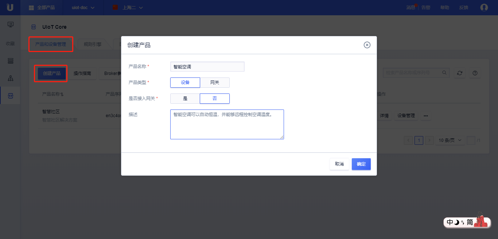
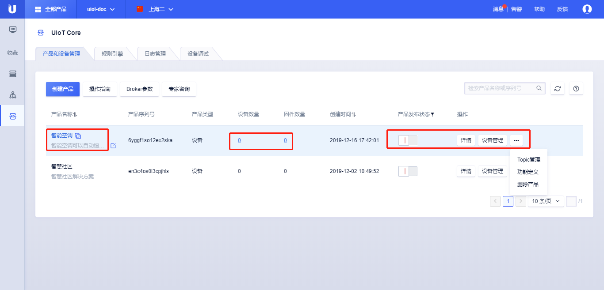

{{indexmenu_n>1}}

# 创建产品
产品是指具有相同功能的的设备的集合，产品可以理解为是设备的抽象，是一个具体型号，而设备则是产品的具体实例，拥有唯一的序列号。

使用UCloud物联网平台，需要先创建产品，然后再在相应的产品下创建设备。物联网平台会为产品创建唯一的标识符**产品序列号**。

## 操作步骤

1. [注册](https://passport.ucloud.cn/#register)UCloud云服务，如已注册请直接第2步。
2. 登录进入UCloud[物联网平台](https://console.ucloud.cn/iot)
3. 选择<产品和设备管理>标签，点击<创建产品>
4. 在弹出的对话框中输入<产品名称>和产品<描述>

	- 产品名称：名称长度为4-32个字符，可包含中文、字母、数字、"_"、"-"、"@"、":"的组合；
	- 产品描述：支持任意字符，长度限制0-100个字符；
	
5. 点击<确定>，创建产品成功；
6. 创建产品成功后，可以在产品列表页查看

	- 点击<产品名称>或<详情>，进入产品详情页；
	
	- 点击<设备数量数>，进入[设备管理](create_devcies\#管理设备)页；
	
	- 点击<固件数量数>，进入[固件管理](../ota/firmware_management)页；
	
	- 点击<发布状态按钮>，发布产品或取消发布产品，产品一旦发布将不能修改物模型、Topic等；
	
	- 点击<设备管理>，进入[设备管理](create_devcies\#管理设备)页；
	
	- 点击<...>，进行[Topic管理](topic)，[功能定义](../thingmode/thingmode_guide)，[删除产品](#删除产品)操作；

## 产品详情

创建完产品后，点击<详情>或者点击<产品名称>，可以查看该产品**产品概览**、**[设备管理](create_devcies\#管理设备)**、**[Topic管理](topic)**、**[功能定义（物模型）](../thingmode/thingmode_guide)**、**[固件与升级](../ota/firmware_management)**。

产品概览页可以查看该产品的**基本信息：**

- 产品名称及描述：创建产品时定义的产品名称及产品描述；
- 产品序列号：产品序列号为系统随机生成的唯一的16位字符串，用户[设备注册](../../device_develop_guide/authenticate_devices/what_is_authenticate_devices)时使用；
- 产品密钥：产品密钥用于批量创建设备时使用，参考[动态注册设备](../../device_develop_guide/authenticate_devices/unique-certificate-per-product_authentication)；
- 产品类型：产品有两种类型设备或网关，网关暂不支持；
- 是否接入网关：该设备是否以子设备接入网关存在，当前还不支持网关；
- 产品发布状态：产品一旦发布将不能修改物模型、Topic；
- 创建时间：创建该产品的时间；

**设备信息：**

- 设备总数：当前产品下已经添加的设备的数量总数，包括已激活和未激活的；
- 激活设备数量：已经激活的设备数量；
- 在线设备数量：当前在线的设备数量；
- 固件数量：已经上传的固件数量；
- 动态注册：是否开启动态注册，参考[动态注册设备](../../device_develop_guide/authenticate_devices/unique-certificate-per-product_authentication)；
- 设备影子：是否使用设备影子，参考[设备影子](../device_shadow/waht_is_deviceshadow);

## 删除产品

创建完产品后，点击<...\>，选择<删除产品>，可以根据提示删除该产品。

删除产品注意事项：

- 删除产品不可恢复，需要谨慎操作；
- 删除产品需要先删除产品下的设备，否则不能删除；
- 删除产品需要先删除关联该产品的规则引擎，否则不能删除；
- 删除产品会同时删除产品下已经上传的固件；

