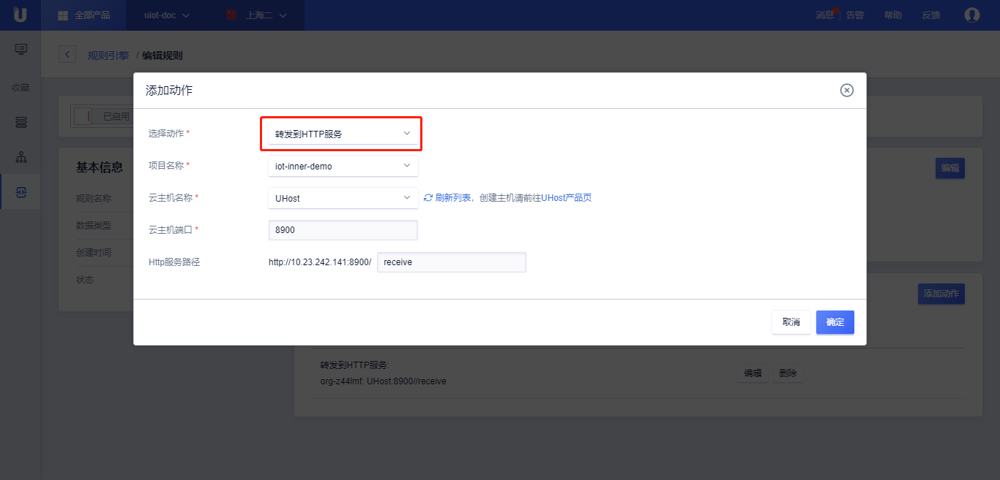

{{indexmenu_n>9}}

# 数据流转到HTTP服务
数据流转到HTTP服务需要：

- 完成[数据流转管理](data_forwarding)中操作步骤的前两步，已经配置好消息筛选SQL；
- 在UCloud购买了[UHost实例](https://console.ucloud.cn/uhost/uhost)，并已经开放端口，提供HTTP服务；

## 操作步骤

1\. 在[数据流转管理](data_forwarding)页面中，点击<添加动作>;

2\. 在弹出的对话框中，选择动作"转发到HTTP服务"；

   - 选择动作：选择需要流转到的目的地，这里选择“转发到HTTP服务”；

   - HTTP服务（UHost实例）：选择已经购买的UHost实例；

   - 端口： 该Host开放服务的端口号，比如80；

   - 路径：提供服务的剩余路径，比如**/temperature**；该服务通过内网转发，会自动拼凑出服务URL，比如 <http://10.x.x.x:80/tmperature>

3\. 填写完毕后，点击<确定>，完成动作的添加；

4\. 回到规则引擎列表页，选择<启用>，规则变为运行状态；

5\. 测试此条规则是否生效；

