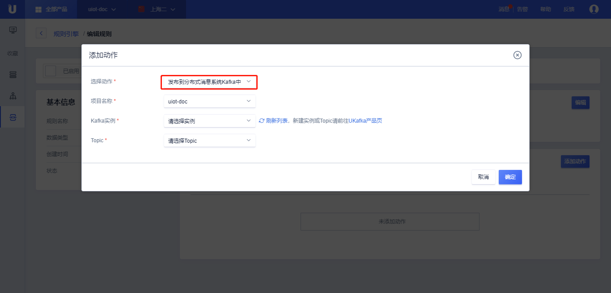

# 数据流转到分布式消息系统kafka
数据流转到分布式消息系统kafka需要：
- 完成[数据流转管理](data_forwarding)中操作步骤的前两步，已经配置好消息筛选SQL；
- 在UCloud购买了[Kafka实例 ](https://console.ucloud.cn/ukafka/ukafka)，并已经配置好Kafka实例，并设置好Kafka的Topic。

## 操作步骤

1. 在[数据流转管理](data_forwarding)页面中，点击<添加动作>;
2. 在弹出的对话框中，选择动作"转发到分布式消息系统Kafka中"；

   - 选择动作：选择需要流转到的目的地，这里选择“转发到分布式消息系统Kafka中”；
   - Kafka实例：选择已经购买的Kafka实例；
   - Topic ： 转发到Kafka的目的Topic；
   
3. 填写完毕后，点击<确定>，完成动作的添加；
4. 回到规则引擎列表页，选择<启用>，规则变为运行状态；
5. 测试此条规则是否生效；

