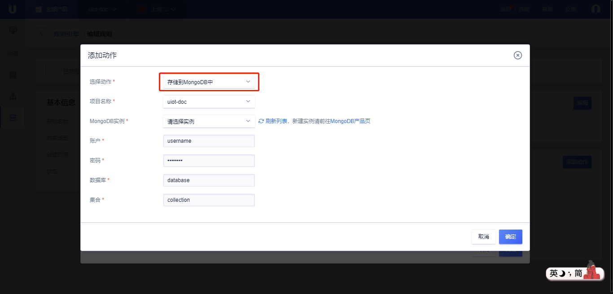

{{indexmenu_n>5}}

# 数据流转到MongoDB
数据流转到MongoDB需要：

- 完成[数据流转管理](data_forwarding)中操作步骤的前两步，已经配置好消息筛选SQL；
- 在UCloud购买了[MongoDB实例](https://console.ucloud.cn/udb/nosql)，并已经配置好账号、密码、数据库、集合；

## 操作步骤

1\. 在[数据流转管理](data_forwarding)页面中，点击<添加动作>;

2\. 在弹出的对话框中，选择动作"存储到MongoDB中"；

   - 选择动作：选择需要流转到的目的地，这里选择“存储到MongoDB中”；

   - MongoDB实例：选择已经购买的MongoDB实例；

   - 登录账户： MongoDB的登录用户名；

   - 登录密码：MongoDB的登录密码；

   - 数据库： 使用MongoDB的哪个数据库；

   - 集合： 使用MongoDB的哪个集合；

3\. 填写完毕后，点击<确定>，完成动作的添加；

4\. 回到规则引擎列表页，选择<启用>，规则变为运行状态；

5\. 测试此条规则是否生效；

