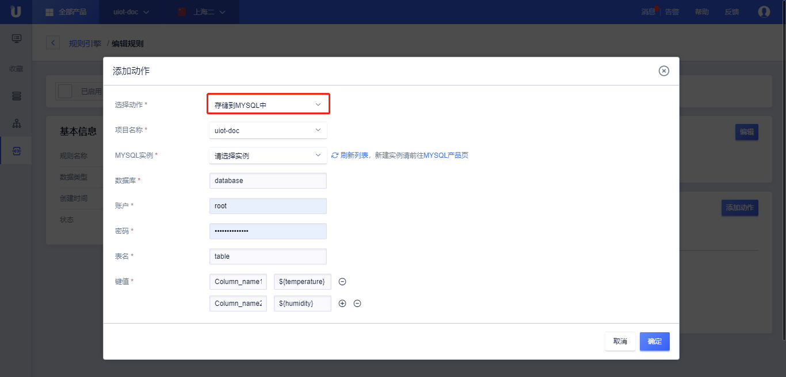

{{indexmenu_n>4}}

# 数据流转到MySQL
数据流转到MySQL需要：

- 完成[数据流转管理]()中操作步骤的前两步，已经配置好消息筛选SQL；
- 在UCloud购买了[MySQL实例](https://console.ucloud.cn/udb/sql)，并已经配置好账号、密码、数据库、集合；

## 操作步骤
1. 在[数据流转管理]()页面中，点击<添加动作>;
2. 在弹出的对话框中，选择动作"存储到MYSQL中"；

   - 选择动作：选择需要流转到的目的地，这里选择“存储到MYSQL中”；
   - MYSQL实例：选择已经购买的MYSQL实例；
   - 数据库： 使用MYSQL的哪个数据库；
   - 账户： MYSQL使用数据库的账户名称；
   - 密码：MYSQL数据库的使用密码；
   - 表名：使用MYSQL所选数据库的哪个表；
   - 键值：键指的是表的字段名，值是消息筛选中的JSON数据键。比如需要流转的消息为：`{"a":1,"b":2}`，SQL筛选语句为：`SELECT * FROM /70ly1tvowt696r15/00:14:32:e1:72:f1/upload`，需要存储到MYSQL的数据库:表为`Database:Table1`，字段分别为`Column1,Column2`，则执行动作的键值可以写为：
   
	|键|值|
	|---|---|
	|Column1|${a}|
	|Column2|${b}|
	
3. 填写完毕后，点击<确定>，完成动作的添加；
4. 回到规则引擎列表页，选择<启用>，规则变为运行状态；
5. 测试此条规则是否生效；

