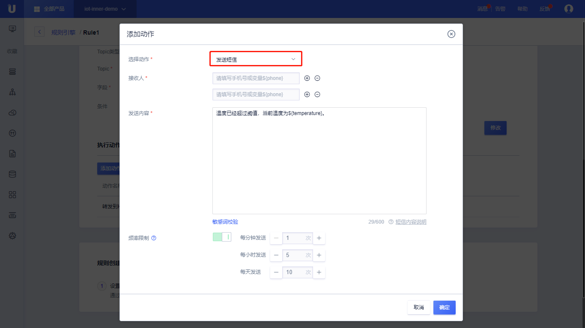

{{indexmenu_n>10}}

# 数据流转到短信
数据流转可以将筛选的数据发送到指定的手机号，或者发送到SQL变量指定的手机字段。

数据流转到其他Topic需要：
- 完成[数据流转管理]()中操作步骤的前两步，已经配置好消息筛选SQL；
- 在UCloud开通了[短信服务 USMS](https://console.ucloud.cn/usms)；

## 操作步骤
1. 在[数据流转管理]()页面中，点击<添加动作>;
2. 在弹出的对话框中，选择动作"发送短信"；
   - 选择动作：选择需要流转到的目的地，这里选择“发送短信”；
   - 接收人：填写满足此规则的接收手机；接收手机也可以从消息字段中获取，使用变量表达式代替，比如`${phone}`；
   - 发送内容：填写需要发送的内容，可以将消息体中的字段使用变量表达式的方式填写到发送内容中，比如：`温度超过40°，为${temperature}`；
   - 频率限制：频率限制为可选项，可以选择每分钟最多发送几次，每小时最多发送几次，每天最多发送几次；比如：每分钟发送1次，每小时发送5次，每天发送10次；如果在前5分钟连续发送了5条，这个小时的量就用完了，如果再等到下个小时连续又发送了5条，那这一天的量就用完了。
3. 填写完毕后，点击<确定>，完成动作的添加；
4. 回到规则引擎列表页，选择<启用>，规则变为运行状态；
5. 测试此条规则是否生效；

## 使用示例

