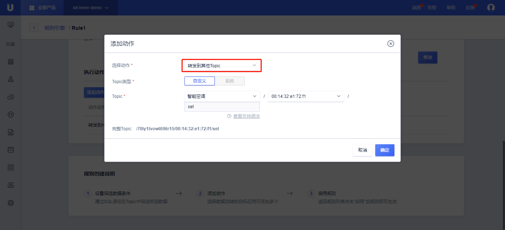

{{indexmenu_n>8}}

# 数据流转到其他Topic
数据流转到其他Topic是指将筛选的消息数据转发到另外一个Topic上，从而实现M2M通信。

数据流转到其他Topic需要：
- 完成[数据流转管理]()中操作步骤的前两步，已经配置好消息筛选SQL；

## 操作步骤
1. 在[数据流转管理]()页面中，点击<添加动作>;
2. 在弹出的对话框中，选择动作"转发到其他Topic"；
   - 选择动作：选择需要流转到的目的地，这里选择“转发到其他Topic”；
   - 选择产品：选择需要转发的产品以及剩余的Topic内容；
   - Topic类型：默认选为<自定义>，暂不支持<系统>；
   - Topic：选择需要流转到的Topic，比如`/70ly1tvowt696r15/00:14:32:e1:72:f1/set`；
   - 完整Topic：实时显示输入的Topic信息；
3. 填写完毕后，点击<确定>，完成动作的添加；
4. 回到规则引擎列表页，选择<启用>，规则变为运行状态；
5. 测试此条规则是否生效；

## 使用示例