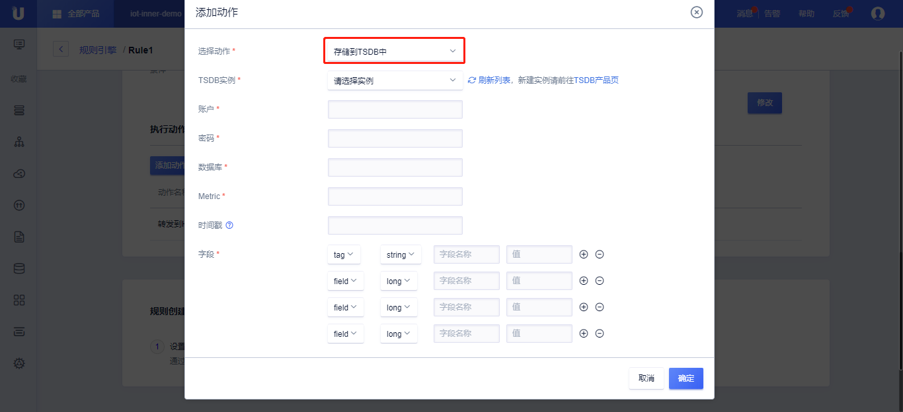

{{indexmenu_n>7}}

# 数据流转到TSDB
数据流转TSDB需要：
- 完成[数据流转管理](data_forwarding)中操作步骤的前两步，已经配置好消息筛选SQL；
- 在UCloud购买了[TSDB实例](https://console.ucloud.cn/utsdb)，并已经配置好账号、密码、数据库、Metric ；

## 操作步骤
1\. 在[数据流转管理](data_forwarding)页面中，点击<添加动作>;

2\. 在弹出的对话框中，选择动作"存储到TSDB中"；

   - 选择动作：选择需要流转到的目的地，这里选择“存储到TSDB中”；
   
   - TSDB实例：选择已经购买的TSDB实例；
   
   - 账户： TSDB的登录用户名；
   
   - 密码：TSDB的登录密码；
   
   - 数据库：转存的TSDB数据库；
   
   - Metric：转存的TSDB的Metric名字；
   
   - 时间戳：Unix时间戳；
   
   - 字段：存储的字段名和消息筛选中的值；

3\. 填写完毕后，点击<确定>，完成动作的添加；

4\. 回到规则引擎列表页，选择<启用>，规则变为运行状态；

5\. 测试此条规则是否生效；

