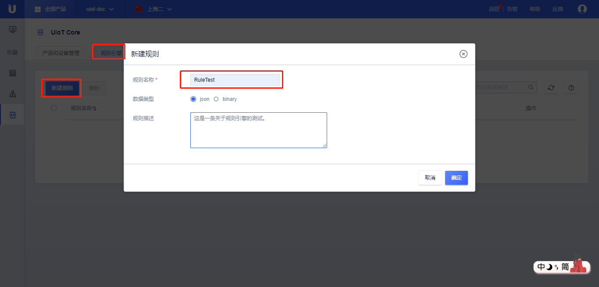
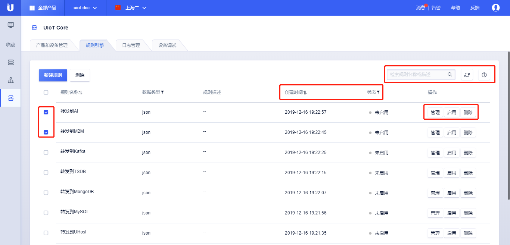

{{indexmenu_n>1}}
# 概览
物联网平台除了提供产品管理、设备管理还提供基于Topic的数据流管理。设备端基于Topic上报的数据可以通过规则引擎进行数据的流转，转发到UCloud平台的其他产品，此功能用户无需进行代码开发。

## 平台支持数据流转的方式

- 数据流转到MySQL中；
- 数据流转到MongoDB中；
- 数据流转到分布式消息系统Kafka中；
- 数据流转到其他Topic，实现M2M；
- 数据流转到UHost的HTTP服务；

注意：

1. UCloud有[项目](https://docs.ucloud.cn/management_monitor/uproject/index)的概念，不同项目间的资源彼此隔离，所以规则引擎只能流转到同一项目下的其他产品，比如UHost；
2. 不同Region的产品不支持相互流转，比如IoT-Core开通Region在上海二区，则规则引擎不能流转到北京Region的UHost。

## 操作步骤：

1\. [注册](https://passport.ucloud.cn/#register)UCloud云服务，如已注册请直接第2步；
2\. 登录进入UCloud[物联网平台](https://console.ucloud.cn/iot)；
3\. 选择<规则引擎>标签；
4\. 点击<新建规则>
   - 输入规则名称，名称必须为中文、字母、数字、下划线的组合，长度为1-32位；
   - 输入描述，描述长度为0-100字符，无特殊字符限制；
   - 选择数据类型：json表示数据格式为json；binar表示对数据不做解析直接透传；
5\. 点击<确定>，创建规则成功；
6\. 点击<现在编辑>，编辑规则引擎；或<以后再说>以后再编辑。
7\. 规则创建后，可以看到规则列表
   - 创建时间：可以按照创建时间进行排序；
   - 状态：可以对规则进行筛选，有<未启用>、<运行>两种状态；
   - 检索规则：可以根据规则名或描述检索规则；
   - 点击<管理>或<规则名称>：可以编辑规则；
   - 启用/禁用：启用或禁用规则，参考[规则启用](#规则启用)；
   - 删除：删除规则，运行状态下的规则无法删除，也可对规则进行批量删除，参考[规则删除](#规则删除)；

## 规则管理

下一节将依次介绍如何编辑规则，为创建的规则添加消息筛选以及配置执行动作，实现消息流转。

## 规则启用

规则启用指的是让规则生效开始运行。

<启用>之后可以通过<禁用>使规则暂不生效。

## 规则删除

规则的删除支持单个删除和批量删除。

规则删除注意事项：
- 启用的规则需要先禁用再删除；
- 规则删除后将无法找回，如需创建需要重新创建；
- 规则删除立即生效；
