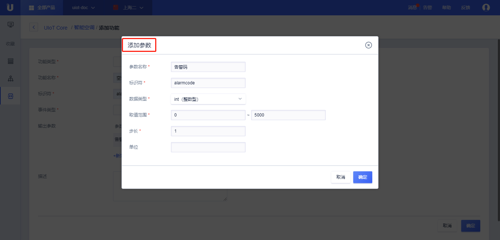

{{indexmenu_n>2}}

# 功能定义流程

## 物模型定义流程
1. [注册](https://passport.ucloud.cn/#register)UCloud云服务，如已注册请直接第2步；
2. 登录进入UCloud[物联网平台](https://console.ucloud.cn/iot)；
3. 进行[物模型功能定义](#物模型功能定义)；
4. 参考[设备端开发-物模型](../../device_develop_guide/thingmode/what_is_thingmode)，基于物模型进行开发；
5. 开发完成，设备端、应用服务基于物模型实现业务逻辑。

## 物模型功能定义
物模型在控制台的位置是<功能定义>，提供完整的交互界面，帮助户进行产品功能的抽象，快速创建物模型。

### 操作步骤
1. [注册](https://passport.ucloud.cn/#register)UCloud云服务，如已注册请直接第2步；
2. 登录进入UCloud[物联网平台](https://console.ucloud.cn/iot)；
3. 选择相应的产品，进入[产品详情](../product_device/create_products#产品详情)；
4. 选择<功能定义>标签；
5. 关闭<产品发布状态>按钮；
   - 产品发布状态：产品发布状态为打开表示当前产品已发布，不能再对物模型或Topic等做修改；
6. 点击<添加功能>，进行[属性](#定义属性)，[命令](#定义命令)，[事件](#定义事件)定义。

### 定义属性

定义属性的名称、类型等，类似于基于对象编程中的成员变量，具有可读（GET）和可写（SET）的权限。
**操作步骤**

1. 点击<添加功能>后，选择<属性>标签；
2. 输入相应的属性内容：
   - 功能名称（必填）：属性的名称，功能名称同一产品下须唯一，如温度。名称支持中文、字母、数字、下划线的组合，长度为1-32位且不能为空。
   - 标识符（必填）：类似于变量名，JSON文件中唯一标识该功能的标识符。支持大小写字母、数字和下划线"_"、不超过32个字符，必须以字母或"_"开头。
   - 数据类型（必填）：
      - int：int32整数型
      - float32：32位浮点型
      - float64：64位浮点型
      - bool：布尔型
      - enum：枚举型
      - string：字符串
      - date：时间型，格式为int 类型的 UTC 时间戳，单位：毫秒
   - 取值范围（必填）：当数据类型为int、float32、float64时，需要填写取值范围，表示数据允许的范围。
   - 步长（必填）：当数据类型为int、float32、float64时，需要填写取值范围，表征属性变化的步进长度。
   - 布尔类型（必填）：当数据类型为bool类型时，填写0和1分别代表的内容。
   - 枚举项（必填）：当数据类型为enum时，分别填写枚举值和对应的描述。
   - 数据长度（必填）：当数据类型为string时，表示字符串的长度。
   - 单位：该属性的单位，比如摄氏度。单位最长为16位字符， 无特殊字符限制。
   - 读写类型（必填）：
     - 只读：该属性仅支持数据上报，不支持下行修改。
     - 读写：该属性既可以上报获取，也可以下行修改设置。
   - 描述（选填）：对属性的描述。描述最长为100字符， 无特殊符号限制。

### 定义命令

命令是指对设备进行下发控制并完成某个动作，命令控制可以理解为面向对象编程中的方法，有输入参数和输出参数，命令调用可分为同步和异步调用，具体可以参考[云端开发指南-SendUIoTCoreDeviceCommand](../../api_guide/tingmodemgmtapi)。

注：初学者经常会困惑属性的设置和命令控制之间的区别，这里具体列下：
- 属性设置的是该属性的具体值；而命令是不依赖属性的值；比如温度类型是int型，可以SET到30°，但是命令往往是一个动作，比如温度调低5°，这个是一个动作而不是一个具体值。
- 命令调用分为同步和异步两种，而属性设置是异步的；
- 命令调用可以有输入参数和输出参数；比如对于智能门锁，“获取开门记录”，就需要输入参数-时间区间、人员ID等，输出参数-开门记录。

**操作步骤**
1. 点击<添加功能>后，选择<命令>标签；
2. 输入相应的命令内容：
   - 功能名称（必填）：命令的名称，功能名称同一产品下须唯一，如调低温度。名称支持中文、字母、数字、下划线的组合，长度为1-32位且不能为空。
   - 标识符（必填）：类似于方法名，JSON文件中唯一标识该功能的标识符。支持大小写字母、数字和下划线"_"、不超过32个字符，必须以字母或"_"开头。
   - 输入参数（选填）：点击<新增参数>，弹出<添加参数>弹框，参考下文参数设置，输入餐宿最多支持20个；
   - 输出参数（选填）：点击<新增参数>，弹出<添加参数>弹框，参考下文参数设置，输出参最多支持20个；
   - 描述（选填）：对命令的描述。描述最长为100字符， 无特殊符号限制。
   

**参数设置**

1. 参数名称（必填）：入参或出参的名称。名称为中文、字母、数字、下划线的组合，长度为1-32位且不能为空。
2. 标识符（必填）：类似于变量名，入参或出参在JSON文件中唯一标识该功能的标识符。支持大小写字母、数字和下划线"_"、不超过32个字符，必须以字母或"_"开头。
3. 数据类型（必填）：      
    - int：int32整数型
    - float32：32位浮点型
    - float64：64位浮点型
    - bool：布尔型
    - enum：枚举型
    - string：字符串
    - date：时间型，格式为int 类型的 UTC 时间戳，单位：毫秒
4. 取值范围（必填）：当数据类型为int、float32、float64时，需要填写取值范围，表示数据允许的范围。
5. 步长（必填）：当数据类型为int、float32、float64时，需要填写取值范围，表征属性变化的步进长度。
6. 布尔类型（必填）：当数据类型为bool类型时，填写0和1分别代表的内容。
7. 枚举项（必填）：当数据类型为enum时，分别填写枚举值和对应的描述。
8. 数据长度（必填）：当数据类型为string时，表示字符串的长度。

### 定义事件
事件一般是某类需要及时被外部感知的消息。事件上报有别于属性的上报，事件是指突发或者非常规情况，需要及时被感知，比如异常进入、高温报警、发动机故障；而属性的上报是对某个正常属性值的上报。

**操作步骤**

1. 点击<添加功能>后，选择<事件>标签；
2. 输入相应的事件内容：
   - 功能名称（必填）：事件的名称，功能名称同一产品下须唯一，如高温报警。名称支持中文、字母、数字、下划线的组合，长度为1-32位且不能为空。
   - 标识符（必填）：JSON文件中唯一标识该功能的标识符。支持大小写字母、数字和下划线"_"、不超过32个字符，必须以字母或"_"开头。
   - 事件类型（必填）：选择事件的具体类型，分为<通知>、<警告>、<故障>，会在JSON文件中表述为"notify, warning, error"不同的字符；
   - 输出参数（选填）：点击<新增参数>，弹出<添加参数>弹框，参考下文参数设置，输出参数最多支持20个；
   - 描述（选填）：事件的描述。描述最长为100字符， 无特殊符号限制。

**参数设置**
1. 参数名称（必填）：输出参数的名称。名称为中文、字母、数字、下划线的组合，长度为1-32位且不能为空。
2. 标识符（必填）：类似于变量名，输出参数在JSON文件中唯一标识该功能的标识符。支持大小写字母、数字和下划线"_"、不超过32个字符，必须以字母或"_"开头。
3. 数据类型（必填）：      
    - int：int32整数型
    - float32：32位浮点型
    - float64：64位浮点型
    - bool：布尔型
    - enum：枚举型
    - string：字符串
    - date：时间型，格式为int 类型的 UTC 时间戳，单位：毫秒
4. 取值范围（必填）：当数据类型为int、float32、float64时，需要填写取值范围，表示数据允许的范围。
5. 步长（必填）：当数据类型为int、float32、float64时，需要填写取值范围，表征属性变化的步进长度。
6. 布尔类型（必填）：当数据类型为bool类型时，填写0和1分别代表的内容。
7. 枚举项（必填）：当数据类型为enum时，分别填写枚举值和对应的描述。
8. 数据长度（必填）：当数据类型为string时，表示字符串的长度。

