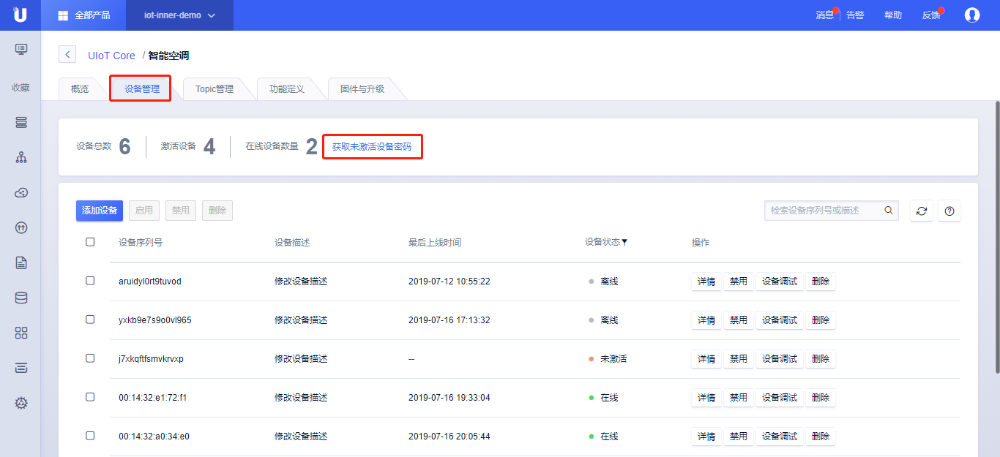

{{indexmenu_n>2}}

# 静态注册
静态注册也叫做一机一密，用户通过物联网平台操作界面，预先生成设备，设备量产时将生成的设备的凭证（**产品序列号**，**设备序列号**，**设备密码**）信息预先烧录到设备中。 当设备被首次使用时，通过预置的凭证接入物联网平台，完成激活认证。

## 操作步骤：

1. 参考控制台操作指南，[创建产品](../../console_guide/product_device/create_products)，[创建设备](../../console_guide/product_device/create_devcies)，[创建单个或多个设备](../../console_guide/product_device/create_devcies#创建单个或多个设备)，批量创建该产品下的设备；

2. 准备工作：

   1. 开发设备端固件，使用[SDK静态注册](#静态注册)开发相应的固件；

   2. 在设备详情页点击<获取未激活设备密码>，导出未激活的设备的凭证（**产品序列号**，**设备序列号**，**设备密码**）；

3. 将步骤2开发的固件以及导出的凭证发给产线烧录，产线给每台设备烧录固件及不同的凭证；

4. 设备首次连接云平台，通过凭证认证激活设备。



## 具体流程：
设备注册的核心是生成MQTT Broker认证需要的三要素：**ClientID**，**UserName**，**Password**。

1. 获取到设备的注册凭证（**产品序列号**，**设备序列号**，**设备密码**），分别表示为**${ProductSN}**，**${DeviceSN}**，**${DevSecret}**；

2. 通过以下规则生成MQTTBroker认证的三要素；

|MQTT认证三要素|生成规则|
|---|---|
|ClientID | ${ProductSN}.${DeviceSN} 举例：70ly1tvowt696r15.aruidyl0rt9tuvod|
|UserName | ```${ProductSN}|${DeviceSN}|${authmode}``` ```举例：70ly1tvowt696r15|aruidyl0rt9tuvod|1``` authmode: 1 表示静态注册；2表示动态注册|
|Password | ${DevSecret} hly3dk1u5y8fq0b9|

3. 参考[下一节设备连接](../connecting_devices)将设备接入到物联网平台；
