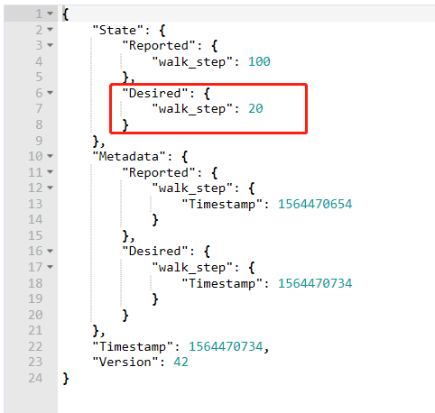
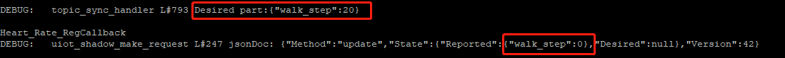
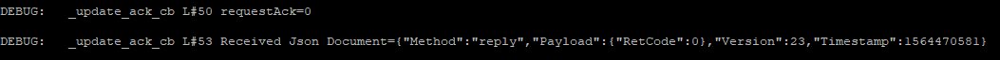
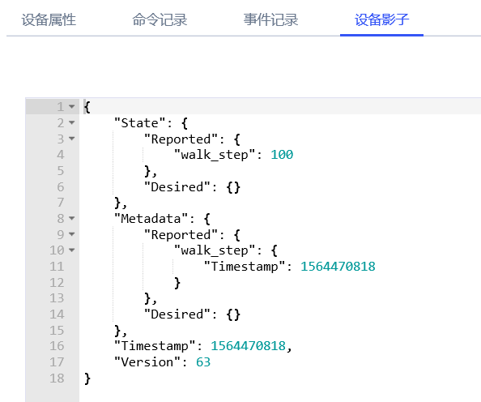

# C-SDK 快速入门

本章描述如何在 Ubuntu 环境，通过设备端 C-SDK 快速接入 UIoT-Core 平台服务。

## 准备开发环境

* 操作系统：`Ubuntu16.04`
* 必备软件：`make`, `gcc`, `git`, `cmake`

本SDK开发测试均在 64 位 Ubuntu16.04 进行，其他 Linux 版本尚未验证。为避免兼容性问题建议使用相同的编译及运行环境。Windows 环境下，建议使用 WSL(Ubuntu on Windows)。

可使用如下命令安装必备软件：

```bash
sudo apt-get install -y build-essential make git gcc cmake
```

## 获取 C-SDK

* ZIP 下载
* GitHub: <https://git.ucloudadmin.com/uiot/c-sdk>

## 编译及运行

C-SDK支持 `GNU Make` 及 `CMake` 构建。

### GNU Make

1. 通过修改 C-SDK 顶层目录下的 make.settings 文件，配置开启或者关闭特定功能模块
2. 在SDK顶层目录运行如下命令:

   ```bash
   make clean
   make
   ```

3. 编译完成后, 生成的可执行文件在当前目录的 output/release/bin 及 output/release/unittest 目录下

### CMake

1. 在SDK顶层目录运行如下命令:

   ```bash
   cmake . -Bbuild && cd build && make
   ```

2. 编译完成后, 生成的可执行文件在当前目录的 build/samples 及 build/tests 目录下


## C-SDK实现智能手环实例 (c-sdk\samples\shadow\smart_bracelet_walk_step_shadow_sample.c)
以智能手环为例结合代码讲解如何使用C-SDK实现设备影子功能。

## 手环功能
定时向云平台上报当前手环记录到的行走步数。

## 结合代码示例讲解

根据硬件平台实现全部HAL层接口，是上层业务功能的基础，以linux平台为例实现HAL_Printf。
```
void HAL_Printf(_IN_ const char *fmt, ...)
{    
	va_list args;    
	va_start(args, fmt);    
	vprintf(fmt, args);    
	va_end(args);    
	fflush(stdout);
}
```

初始化MQTT的连接参数，此处直接使用设备密钥进行静态认证。


将控制台上用户自己创建的产品设备信息替换以下宏

```
#define UIOT_MY_PRODUCT_SN            "dpetdroyt44ryjoh"
#define UIOT_MY_DEVICE_SN             "5q3en2xpj3gmmshn"
#define UIOT_MY_DEVICE_SECRET         "i74mv5vxw2kyz4cw"

...

static int _setup_connect_init_params(MQTTInitParams* initParams)
{    
	int ret = SUCCESS;
	initParams->device_sn = (char *)UIOT_MY_DEVICE_SN;
	initParams->product_sn = (char *)UIOT_MY_PRODUCT_SN;
	initParams->device_secret = (char *)UIOT_MY_DEVICE_SECRET;
	initParams->command_timeout = UIOT_MQTT_COMMAND_TIMEOUT;
	initParams->keep_alive_interval = UIOT_MQTT_KEEP_ALIVE_INTERNAL;
	initParams->auto_connect_enable = 1;    
	return ret;
}
```

建立MQTT连接。
```
	ret = _setup_connect_init_params(&sg_initParams);    
	if(ret != SUCCESS)    
	{        
		HAL_Printf("_setup_connect_init_params fail:%d\n", ret);        
		return ret;    
	}        

	void *mqtt_client = IOT_MQTT_Construct(&sg_initParams);    
	if(mqtt_client == NULL)    
	{        
		HAL_Printf("IOT_MQTT_Construct fail\n");        
		return ERR_PARAM_INVALID;    
	}        
```

以产品序列号，设备序列号，MQTT连接的句柄当做入参，初始化设备影子文档。
```
	void *shadow_client = IOT_Shadow_Construct(UIOT_MY_PRODUCT_SN, UIOT_MY_DEVICE_SN, mqtt_client);    
	if(shadow_client == NULL)    
	{        
		HAL_Printf("IOT_Shadow_Construct fail\n");        
		return ERR_PARAM_INVALID;    
	}       

	sg_pshadow = (UIoT_Shadow *)shadow_client;    
	bool isConnected = IOT_MQTT_IsConnected(sg_pshadow->mqtt);    
	if(isConnected != true)    
	{        
		HAL_Printf("IOT_MQTT_IsConnected fail\n");        
		return ERR_PARAM_INVALID;    
	}
```

根据手环的功能定义属性行走步数，类型为整型，实现属性的回调函数(定义说明见设备影子开发文档)，需要在对设备影子做操作前注册好设备拥有的属性。<br>
因为当前实例行走步数只能由设备端修改，服务器端不能修改，因此回调函数中不比较两个值的大小，而直接将设备端的属性值上报上去修改云平台的值。
```
	/* 行走步数只能通过设备上报到云端，云端不能控制数值 */
	void Walk_Step_Callback(void *pClient, RequestParams *pParams, char *pJsonValueBuffer, uint32_t valueLength, DeviceProperty *pProperty)
	{    
		IOT_Shadow_Request_Add_Delta_Property(pClient, pParams,pProperty);    
		HAL_Printf("Heart_Rate_RegCallback\n");    
		return;
	}
```

属性回调函数的调用示例<br>
1.在云平台上修改设备影子文档，设置一个属性的期望值。<br>


2.当设备发现云平台下发的期望值时会调用属性的回调函数处理。使用设备当前属性值更新云平台上的属性值<br>



完成属性的回调函数后，注册设备属性。
```
    /* 手环统计的行走步数 */    
	DeviceProperty *property_walk_step = (DeviceProperty *)HAL_Malloc(sizeof(DeviceProperty));    
	uint32_t walk_step_num = 0;    
	char walk_step_str[64] = "walk_step";    
	property_walk_step->key= walk_step_str;    
	property_walk_step->data = &walk_step_num;    
	property_walk_step->type = JUINT32;    
	ret = IOT_Shadow_Register_Property(sg_pshadow, property_walk_step, Walk_Step_Callback);     
	if(SUCCESS != ret)    
	{        
		HAL_Printf("Register walk_step fail:%d\n", ret);        
		return ret;    
	}
```

对云平台的请求也有回调函数需要用户实现，每次请求的回调函数都可以不一样，当云平台返回执行结果时，将调用请求的回调函数。<br>
本例的回调函数是获取请求的执行结果，并打印云平台的响应消息。
```
static void _update_ack_cb(void *pClient, Method method, RequestAck requestAck, const char *pReceivedJsonDocument, void *pUserdata)
{ 	
	LOG_DEBUG("requestAck=%d\n", requestAck);    
	if (NULL != pReceivedJsonDocument)
	{        
		LOG_DEBUG("Received Json Document=%s\n", pReceivedJsonDocument);    
	}
	else
	{        
		LOG_DEBUG("Received Json Document is NULL\n");    
	}    

	*((RequestAck *)pUserdata) = requestAck;    
	return;
}
```
请求回调函数的执行示例<br>
当云平台处理完设备发送给他的请求后，返回响应结果和消息时会调用请求回调函数。<br>


设备可能由于掉电等原因和服务器断开一段时间，这段时间服务器端设备影子的改动需要同步一下。<br>
以上个步骤完成的请求回调函数做入参向云平台发送同步文档请求。
```
	/* 先同步一下版本号和设备掉电期间更新的属性 */    
	ret = IOT_Shadow_Get_Sync(sg_pshadow, _update_ack_cb, time_sec, &ack_update);    
	if(SUCCESS != ret)    
	{        
		HAL_Printf("Get Sync fail:%d\n", ret);        
		return ret;    
	}

	while (ACK_NONE == ack_update)
	{        
		IOT_Shadow_Yield(sg_pshadow, MAX_WAIT_TIME_MS);    
	}
```

前期准备工作完成，现在可以对设备影子做修改了。在对设备影子做同步和更新操作时，需要增加一段延时给CPU一段处理的时间等待云平台的响应消息。<br>
下面代码是模拟运动时行走步数的增长并上报云平台修改设备影子文档。
```
	/* 模拟心率升高产生告警的场景 */    
	while(1)    
	{            
		walk_step_num = walk_step_num + 5;   

		ret = IOT_Shadow_Update(sg_pshadow, _update_ack_cb, time_sec, &ack_update, 1, property_walk_step);            
		if(SUCCESS != ret)            
		{                
			HAL_Printf("Update walk_step fail:%d\n", ret);                
			return ret;            
		}            

		ack_update = ACK_NONE;            
		while (ACK_NONE == ack_update)
		{                
			IOT_Shadow_Yield(sg_pshadow, MAX_WAIT_TIME_MS);            
		}            
		IOT_Shadow_Yield(sg_pshadow, 3000);            
		if(walk_step_num >= 100)            
		{                
			HAL_Printf("today's goal is completed!\n");                
			break;            
		}    
	}
```
执行结果



执行结束，释放本地资源。
```
	HAL_Free(property_walk_step);    
	IOT_Shadow_Destroy(sg_pshadow);
```

## 查看日志
通过日志可以看到一段时间内设备所有的上行和下行消息。


