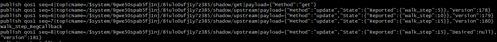

# C-SDK 快速入门

本章描述如何在 Ubuntu 环境，通过设备端 C-SDK 快速接入 UIoT-Core 平台服务。

## 准备开发环境

* 操作系统：**Ubuntu16.04**
* 必备软件：**make**, **gcc**, **git**, **cmake**

本SDK开发测试均在 64 位 Ubuntu16.04 进行，其他 Linux 版本尚未验证。为避免兼容性问题建议使用相同的编译及运行环境。Windows 环境下，建议使用 WSL(Ubuntu on Windows)。

可使用如下命令安装必备软件：

```
sudo apt-get install -y build-essential make git gcc cmake
```

## 获取 C-SDK

* [GitHub](https://github.com/ucloud/ucloud-iot-device-sdk-c)

```
git clone https://github.com/ucloud/ucloud-iot-device-sdk-c
```

## 编译及运行

C-SDK支持 **GNU Make** 及 **CMake** 构建，开发者可以选择自己熟悉的编译。

### GNU Make

1\. 通过修改 C-SDK 顶层目录下的 make.settings 文件，配置开启或者关闭特定功能模块

2\. 在SDK顶层目录运行如下命令:

```
  make clean
  make
```

3\. 编译完成后, 生成的可执行文件在当前目录的 output/release/bin目录下

### CMake

1\. 在SDK顶层目录运行如下命令:

```
  cmake . -Bbuild && cd build && make
```

2\. 编译完成后, 生成的可执行文件在当前目录的 build/samples 及 build/tests 目录下


## 基于C-SDK实现智能手环接入UIoT-Core 

本例结合代码讲解如何使用C-SDK的设备影子功能实现智能手环的功能：

* 定时向云平台上报当前手环记录到的行走步数。
* 详细代码及main函数参考：./samples/shadow/smart_bracelet_walk_step_shadow_sample.c


**注：以下所有路径均是基于SDK根目录展开**


### 移植步骤

1\. 基于使用的OS的实现HAL层接口

HAL层是对不同操作系统的抽象，HAL层适配了不同操作系统关于线程、内存、Timer、TCP的操作。UCloud IoT C-SDK已经实现了linux、FreeRTOS下的HAL层实现。

本例以linux平台为例，实现HAL接口HAL\_Printf：**./platform/os/linux/HAL\_OS\_linux.c**。


```
  void HAL_Printf(_IN_ const char *fmt, ...)
  {    
  	va_list args;    
  	va_start(args, fmt);    
  	vprintf(fmt, args);    
  	va_end(args);    
  	fflush(stdout);
  }
```

2\. 获取产品序列号、设备序列号、设备密钥，通过C-SDK接入UIoT-Core。  


1) 参考[设备详情](../../console_guide/product_device/create_devcies#设备详情)获取设备三要素；


2) 通过三要素通过[静态注册](../authenticate_devices/unique-certificate-per-device_authentication)接入到UIoT-Core

修改**./samples/shadow/smart_bracelet_walk_step_shadow_sample.c**中对应的宏。

```
  // 接入UIoT-Core三要素（需要根据控制台信息修改）
  #define UIOT_MY_PRODUCT_SN            "dpetdroyt44ryjoh"
  #define UIOT_MY_DEVICE_SN             "5q3en2xpj3gmmshn"
  #define UIOT_MY_DEVICE_SECRET         "i74mv5vxw2kyz4cw"
  
  ...
  
  // 初始化参数
  static int _setup_connect_init_params(MQTTInitParams* initParams)
  {    
  	int ret = SUCCESS;
  	initParams->device_sn = (char *)UIOT_MY_DEVICE_SN;
  	initParams->product_sn = (char *)UIOT_MY_PRODUCT_SN;
  	initParams->device_secret = (char *)UIOT_MY_DEVICE_SECRET;
  	initParams->command_timeout = UIOT_MQTT_COMMAND_TIMEOUT;
  	initParams->keep_alive_interval = UIOT_MQTT_KEEP_ALIVE_INTERNAL;
  	initParams->auto_connect_enable = 1;    
  	return ret;
  }
```

3) 建立MQTT连接。

```
  ret = _setup_connect_init_params(&sg_initParams);    
  if(ret != SUCCESS)    
  {        
  	HAL_Printf("_setup_connect_init_params fail:%d\n", ret);        
  	return ret;    
  }        
  
  void *mqtt_client = IOT_MQTT_Construct(&sg_initParams);    
  if(mqtt_client == NULL)    
  {        
  	HAL_Printf("IOT_MQTT_Construct fail\n");        
  	return ERR_PARAM_INVALID;    
  }        
```

4) 以产品序列号，设备序列号，MQTT连接的句柄当做入参，初始化设备影子文档。

```
  void *shadow_client = IOT_Shadow_Construct(UIOT_MY_PRODUCT_SN, UIOT_MY_DEVICE_SN, mqtt_client);    
  if(shadow_client == NULL)    
  {        
  	HAL_Printf("IOT_Shadow_Construct fail\n");        
  	return ERR_PARAM_INVALID;    
  }       
  
  sg_pshadow = (UIoT_Shadow *)shadow_client;    
  bool isConnected = IOT_MQTT_IsConnected(sg_pshadow->mqtt);    
  if(isConnected != true)    
  {        
  	HAL_Printf("IOT_MQTT_IsConnected fail\n");        
  	return ERR_PARAM_INVALID;    
  }
```

3\. 云端修改**行走步数**，设备端进行回调打印

设备影子是设备端在云平台的缓存，应用程序可以对其属性值进行修改，详情参考[更新设备影子期望值](../../console_guide/device_shadow/operation_guide#应用程序更新设备影子期望值)。

注：本例中设备端获取到云端设置的期望值后，仅做打印处理。


```
  // 创建回调函数
   /* 云端设置期望值后的回调函数 */
  void Walk_Step_Callback(void *pClient, RequestParams *pParams, char *pJsonValueBuffer, uint32_t valueLength, DeviceProperty *pProperty)
  {    
  	IOT_Shadow_Request_Add_Delta_Property(pClient, pParams,pProperty);    
  	HAL_Printf("Heart_Step_RegCallback\n");    
  	return;
  }
  
  ...
  
  /* 注册回调函数 */
  ret = IOT_Shadow_Register_Property(sg_pshadow, property_walk_step, Walk_Step_Callback);
  if(SUCCESS != ret)
  {
      HAL_Printf("Register walk_step fail:%d\n", ret);
      return ret;
  }
```

4\. 设备上报属性值

通过设备影子上报属性值，详情可以参考[设备端上报状态更新设备影子](../../console_guide/device_shadow/operation_guide#设备端上报状态更新设备影子)。

设备影子上报属性后，云平台会给出响应，SDK需要设置对应的回调函数处理响应结果。


```
  /* 收到云平台响应后的回调函数 */
  static void _update_ack_cb(void *pClient, Method method, RequestAck requestAck, const char *pReceivedJsonDocument, void *pUserdata)
  {
  		LOG_DEBUG("requestAck=%d\n", requestAck);
  
  	if (NULL != pReceivedJsonDocument) {
  		LOG_DEBUG("Received Json Document=%s\n", pReceivedJsonDocument);
  	} else {
  		LOG_DEBUG("Received Json Document is NULL\n");
  	}
  
  	*((RequestAck *)pUserdata) = requestAck;
  	return;
  }
  
  ....
  
  walk_step_num = walk_step_num + 5;
  
  /* 上报属性值 */
  ret = IOT_Shadow_Update(sg_pshadow, _update_ack_cb, time_sec, &ack_update, 1, property_walk_step);
  if(SUCCESS != ret)
  {
      HAL_Printf("Update walk_step fail:%d\n", ret);
      return ret;
  }
  
  ack_update = ACK_NONE;
  while (ACK_NONE == ack_update) {
      IOT_Shadow_Yield(sg_pshadow, MAX_WAIT_TIME_MS);
  }

```


5\. 与云端同步设备影子


设备由于网络不稳定或者设备复位导致设备与云平台失去连接，此时如果云平台对设备进行期望设置，设置值将会暂存在云端的设备影子中。

设备再次上线后，需要先和云平台做一次同步，获取设备影子最新状态，具体参考[设备端获取设备影子文档](../../console_guide/device_shadow/operation_guide#设备端获取设备影子文档)。


```
  /* 收到云平台响应后的回调函数 */
  static void _update_ack_cb(void *pClient, Method method, RequestAck requestAck, const char *pReceivedJsonDocument, void *pUserdata)
  {
  		LOG_DEBUG("requestAck=%d\n", requestAck);
  
  	if (NULL != pReceivedJsonDocument) {
  		LOG_DEBUG("Received Json Document=%s\n", pReceivedJsonDocument);
  	} else {
  		LOG_DEBUG("Received Json Document is NULL\n");
  	}
  
  	*((RequestAck *)pUserdata) = requestAck;
  	return;
  }
  
  ...
  
  /* 先同步一下版本号和设备掉电期间更新的属性 */
  ret = IOT_Shadow_Get_Sync(sg_pshadow, _update_ack_cb, time_sec, &ack_update);
  if(SUCCESS != ret)
  {
      HAL_Printf("Get Sync fail:%d\n", ret);
      return ret;
  }
  
      while (ACK_NONE == ack_update) {
      IOT_Shadow_Yield(sg_pshadow, MAX_WAIT_TIME_MS);
  }

```

6\. 执行结束，释放本地资源


```
  HAL_Free(property_walk_step);    
  OT_Shadow_Destroy(sg_pshadow);
```


### 执行结果


1\. 重新编译并执行

```
make clean
make
./output/release/bin/smart_bracelet_walk_step_shadow_sample
```

2\. 第一次上线后同步属性值以及上报属性值


3\. 参考[设备影子查看与更新](../../console_guide/device_shadow/waht_is_deviceshadow#设备影子查看与更新)更新设备影子期望值。


**操作步骤：**

- 点击控制台设备影子页的<编辑>；


- 输入Desired的期望值；


- 点击<确定>下发命令；


4\. 设备端处理下发的期望




## 查看日志

通过日志可以看到一段时间内设备所有的上行和下行消息。


