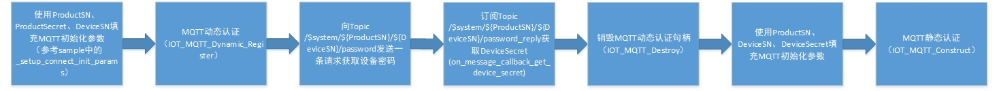
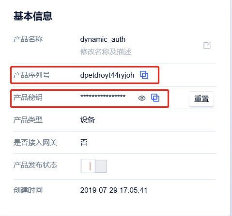
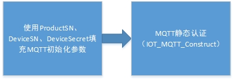
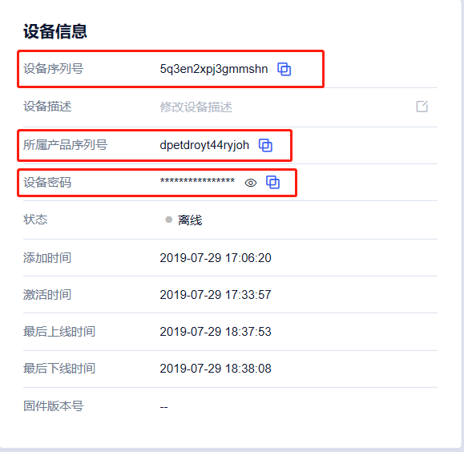

# MQTT与设备认证开发

目前物联网通信支持MQTT标准协议接入（兼容3.1.1版本协议），具体的协议请参考MQTT 3.1.1协议文档

## 和标准MQTT区别

1. 支持 MQTT 的 PUB、SUB、PING、PONG、CONNECT、DISCONNECT、UNSUB 等报文。

2. 支持 cleanSession。

3. 不支持 will、retain msg。

4. 不支持 QOS2。

## MQTT通道，安全等级

支持TLS协议建立安全连接，保证通信内容安全性。

# 设备身份认证

设备身份认证分为动态认证和静态认证两种。

# 动态认证

动态认证即一型一密，首先需要确保打开CMakeLists文件中的ENABLE\_FEATURE\_AUTH\_MODE\_DYNAMIC编译开关，


提前在设备上烧写产品序列号，产品密钥，设备序列号，通过HAL层的接口获取设备信息，填入MQTT的初始连接参数中，


向云平台进行动态身份认证，动态认证成功后会从云平台获取DeviceSecret并通过HAL_SetDeviceSecret接口保存。


用户需要通过HAL_GetDeviceSecret接口获取到DeviceSecret填到MQTT连接参数中并重新进行静态认证。需要注意的


是已经进行过静态认证的设备如果再进行动态认证会失败。

```
option(ENABLE_FEATURE_AUTH_MODE_DYNAMIC "是否打开设备动态注册" ON)
```




## 代码示例
(samples\shadow\dynamic_auth_sample.c)

产品序列号，产品密钥，设备序列号信息填入MQTT初始化信息，其他信息可以使用默认参数或者根据实际需求调整。
event_handler.f_fp需要用户自己实现，用于处理云平台的MQTT响应消息。将控制台上的设备信息替换下列宏。




```
/* 产品序列号, 与云端同步设备状态时需要  */
#define UIOT_MY_PRODUCT_SN            "dpetdroyt44ryjoh"/*     
设备序列号, 与云端同步设备状态时需要, 静态认证后的设备不能进行动态认证，    因此每次执行该用例需要新建一个设备。*/
#define UIOT_MY_DEVICE_SN             "pn15di85odl6n6g8"
#define UIOT_MY_PRODUCT_SECRET        "1b1j2gimjlftmtid"

...

void event_handler(void *pclient, void *handle_context, MQTTEventMsg *msg)
{
	LOG_DEBUG("Enter event_handler!type:%d\n",msg->event_type);
}

...

static int _setup_connect_init_params(MQTTInitParams* initParams)
{
	initParams->device_sn = (char *)UIOT_MY_DEVICE_SN;
	initParams->product_sn = (char *)UIOT_MY_PRODUCT_SN;
	initParams->product_secret = (char *)UIOT_MY_PRODUCT_SECRET;  //动态认证需要产品密钥
	initParams->command_timeout = UIOT_MQTT_COMMAND_TIMEOUT;
	initParams->keep_alive_interval_ms = UIOT_MQTT_KEEP_ALIVE_INTERNAL;
	initParams->auto_connect_enable = 1;
	initParams->event_handler.h_fp = event_handler;
	initParams->event_handler.context = NULL;    
	return SUCCESS;
}
```

动态认证完成后，通过HAL接口获取设备密钥，进行静态认证

```
	ret = _setup_connect_init_params(&init_params);
	if (ret != SUCCESS) {  
		return ret;
	}       

	ret = IOT_MQTT_Dynamic_Register(&init_params);
	if (ret != SUCCESS) {  
		return ret;
	}       

	ret = HAL_GetDeviceSecret(secret);    
	if(ret != SUCCESS)    
	{           
		LOG_ERROR("get device secret fail\n");        
		return ret;    
	}    

	LOG_DEBUG("Password:%s\n",init_params.device_secret);    
	init_params.device_secret = secret;    
	void *static_client = IOT_MQTT_Construct(&init_params);    
	if(static_client == NULL)    
	{          
		LOG_ERROR("static_client Construct fail\n");        
		return FAILURE;    
	}

```

# 静态认证

静态认证即一机一密，相比一型一密的安全性比较高，推荐使用，提前在设备上烧写产品序列号，设备序列号，设备密钥。


通过HAL层的接口获取设备信息，填入MQTT的初始连接参数中，向物联网平台进行身份认证。



## 代码示例
(samples\shadow\mqtt_sample.c)

产品序列号，设备序列号，设备密钥信息填入MQTT初始化信息，其他信息可以使用默认参数或者根据实际需求调整。


将控制台上用户自己创建的产品设备信息替换以下宏。



```
#define UIOT_MY_PRODUCT_SN            "dpetdroyt44ryjoh"
#define UIOT_MY_DEVICE_SN             "5q3en2xpj3gmmshn"
#define UIOT_MY_DEVICE_SECRET         "i74mv5vxw2kyz4cw" ...

...

static int _setup_connect_init_params(MQTTInitParams* initParams)
{
	initParams->device_sn = UIOT_MY_DEVICE_SN;
	initParams->product_sn = UIOT_MY_PRODUCT_SN;
	initParams->device_secret = UIOT_MY_DEVICE_SECRET; //静态认证需要设备密钥
	initParams->command_timeout = UIOT_MQTT_COMMAND_TIMEOUT;
	initParams->keep_alive_interval_ms = UIOT_MQTT_KEEP_ALIVE_INTERNAL;
	initParams->auto_connect_enable = 1;
	initParams->event_handler.h_fp = event_handler;
	initParams->event_handler.context = NULL;    
	HAL_SetProductSN(initParams->product_sn);      
	HAL_SetDeviceSN(initParams->device_sn);    
	HAL_SetDeviceSecret(initParams->device_secret);    
	return SUCCESS;
}
```

配置完设备信息，直接进行静态认证

```
	rc = _setup_connect_init_params(&init_params);
	if (rc != SUCCESS)
	{  
		return rc;
	}    
	void *client = IOT_MQTT_Construct(&init_params);    
	if (client != NULL)
	{
	        HAL_Printf("Cloud Device Construct Success");    
	}
	else
	{
	        HAL_Printf("Cloud Device Construct Failed");
	        return FAILURE;    
	}
```

# MQTT接口说明

## IOT_MQTT_Construct

创建MQTT连接句柄

```
void *IOT_MQTT_Construct(MQTTInitParams *pParams);
```

### 参数列表

| 参数 | 数据类型 | 参数类型 | 说明 |
| --- | --- | --- | --- |
| pParams | MQTTInitParams * | 输入 | 创建MQTT连接的参数 |
| ret | void * | 返回 | MQTT的句柄 |

## IOT_MQTT_Destroy

销毁MQTT连接句柄。

```
void IOT_MQTT_Destroy(void **pClient);
```

### 参数列表

| 参数 | 数据类型 | 参数类型 | 说明 |
| --- | --- | --- | --- |
| pClient | void *\* | 输入 | 指向MQTT句柄的指针 |

## IOT_MQTT_Yield

MQTT会话阶段,MQTT主循环函数, 内含了心跳的维持, 服务器下行报文的收取等

```
int IOT_MQTT_Yield(void *pClient, uint32_t timeout_ms)
```

### 参数列表

| 参数 | 数据类型 | 参数类型 | 说明 |
| --- | --- | --- | --- |
| pClient | void *\* | 输入 | 指向MQTT句柄的指针 |
| timeout\_ms | uint32\_t | 输入 | 等待时间，单位是ms |
| ret | int | 返回 | 成功返回SUCCESS, FAILURE表示失败 |

## IOT_MQTT_Publish

MQTT连接后,向指定topic发送消息。

```
int IOT_MQTT_Publish(void *pClient, char *topicName, PublishParams *pParams);
```

### 参数列表

| 参数 | 数据类型 | 参数类型 | 说明 |
| --- | --- | --- | --- |
| pClient | void * | 输入 | MQTT句柄 |
| topicName | char * | 输入 | 发送消息的topic名称 |
| pParams | PublishParams * | 输入 | 发送消息的内容和相关参数 |
| ret | int | 返回 | 发送成功返回packet\_id, FAILURE表示失败 |

## IOT_MQTT_Subscribe

MQTT连接后,订阅指定topic。

```
int IOT_MQTT_Subscribe(void *pClient, char *topicFilter, SubscribeParams *pParams);
```

### 参数列表

| 参数 | 数据类型 | 参数类型 | 说明 |
| --- | --- | --- | --- |
| pClient| void * | 输入 | MQTT句柄 |
| topicFilter | char * | 输入 | 主题过滤器 |
| pParams | SubscribeParams * | 输入 | 订阅topic的服务质量,回调函数等参数 |
| ret | int | 返回 | 订阅成功返回packet\_id, FAILURE表示失败 |

## IOT_MQTT_Unsubscribe

取消订阅指定topic

```
int HAL_MQTT_Unsubscribe(void *pClient, char *topicFilter);
```

### 参数列表

| 参数 | 数据类型 | 参数类型 | 说明 |
| --- | --- | --- | --- |
| pClient| void * | 输入 | MQTT句柄 |
| topicFilter | char * | 输入 | 主题过滤器 |
| ret | int | 返回 | 订阅成功返回packet\_id, FAILURE表示失败 |

## IOT_MQTT_IsConnected

确认MQTT是否正处于连接状态

```
bool IOT_MQTT_IsConnected(void *pClient);
```

### 参数列表

| 参数 | 数据类型 | 参数类型 | 说明 |
| --- | --- | --- | --- |
| pClient| void * | 输入 | MQTT句柄 |
| ret | bool | 返回 | true表示已连接, false表示已断开 |

## IOT_MQTT_Dynamic_Register

动态认证连接MQTT服务器

```
int IOT_MQTT_Dynamic_Register(MQTTInitParams *pParams);
```

### 参数列表

| 参数 | 数据类型 | 参数类型 | 说明 |
| --- | --- | --- | --- |
| pParams| MQTTInitParams * | 输入 | MQTT连接参数 |
| ret | bool | 返回 | SUCCESS表示获取成功 FAILURE表示获取失败 |
