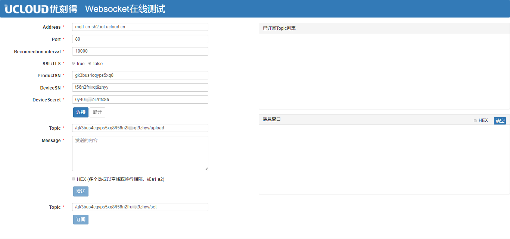

# 基于MQTT-WebSocket协议建立连接

MQTT协议（Message Queuing Telemetry Transport），叫做遥信消息队列传输。本节介绍基于WebSocket的MQTT连接，从而帮助WEB浏览器实现基于MQTT物联网通信云平台的长连接。

## MQTT连接注意事项

- 支持ws和wss；

- 支持最高协议版本MQTT3.1，不支持MQTT5.0；
- 不支持will、retain 消息；
- 不支持QoS2；
- 支持clean session；
- 同一注册凭证（`产品序列号`，`设备序列号`，`设备密码`）同时只能有一个设备在线，其它会被踢下线；
- 支持TLSV1.2 版本的协议来建立安全连接，安全级别高；
- MQTT-WebSocket使用国际授信TLS根证书，浏览器可以直接使用，也可以从这里[下载CA证书](http://uiot.cn-sh2.ufileos.com/iot_ca.crt)；
- MQTT client不能跨Topic订阅或发布消息，只能在自己的所属Topic上订阅或发布消息；

## 具体流程：

MQTT-WebSocket连接需要先了解[设备注册](../authenticate_devices/what_is_authenticate_devices)中提到的静态注册和动态注册，获取 `ClientID`，`UserName`，`Password`。
1. MQTT-WebSocket如需使TLS加密传输，使用国际授信TLS根证书，浏览器可以直接使用，也可以从这里[下载CA证书](http://uiot.cn-sh2.ufileos.com/iot_ca.crt)；
2. 基于javascrip开源库[MQTT.js](https://github.com/mqttjs/MQTT.js)或[paho.mqtt.javascript](https://github.com/eclipse/paho.mqtt.javascript)进行开发，[MQTT协议](http://mqtt.org/?spm=a2c4g.11186623.2.12.577678dc5E6Qcl)详解可以参考[MQTT官网](http://mqtt.org/?spm=a2c4g.11186623.2.12.577678dc5E6Qcl)；
3. MQTT连接

|参数| 详解|
|---|---|
|连接域名 | mqtt-cn-sh2.ucloud.cn （不同区域连接域名不同，目前仅在上海Region开放）|
|端口号 |`80` 或 `443(使用TLS)`|
|可变报头（variable header）：Keep Alive  |  Connect指令中需包含Keep Alive（保活时间）。 取值范围为30至1200秒。如取值不在此区间，平台拒绝连接。建议取值300秒以上，如网络不稳定，设置高一些。|
|MQTT的Connect报文参数|参考[静态注册](../authenticate_devices/unique-certificate-per-device_authentication)和[动态注册](../authenticate_devices/unique-certificate-per-product_authentication) **静态注册为例：** `ClientID：${ProductSN}.${DeviceSN}` `UserName：${ProductSN}\|${DeviceSN}\|${authmode}` `authmode: 静态注册为1；动态注册为2` `Password：${DeviceSecret}`|

4. 连接成功后需要定期发送心跳包保活，设备端在保活时间间隔内，至少需要发送一次报文，如果物联网平台在该间隔内无法收到任何报文，物联网平台会断开连接，设备端需要进行重连。  

### 消息上行及下行

设备连接成功后即可订阅或发布消息，物联网平台支持
- 自定义Topic，参考[用户自定义Topic](../console_guide/product_device/topic#用户自定义Topic)；
- 基于[设备影子](../console_guide/device_shadow/waht_is_deviceshadow)或者[物模型](../console_guide/thingmode/what_is_thingmode)进行开发，Topic参考[系统Topic](../console_guide/product_device/topic#系统Topic)；

## 示例

使用WebSocket可以便于在WEB浏览器建立MQTT长连接，下载下面的例子双击打开**index.html**可以体验。

[WebSocket Over MQTT WEB页面使用示例下载](http://uiot.cn-sh2.ufileos.com/mqtt_over_ws_tool.zip)。

