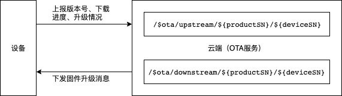
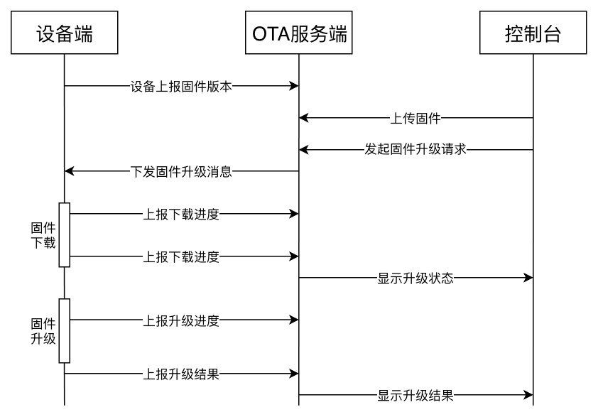

{{indexmenu_n>6}}

# 设备OTA升级


OTA（Over-the-Air Technology）即空中下载技术。在设备端开发中可以理解为固件升级技术。用户可以基于物联网平台的OTA技术直接进行OTA升级、应用配置远程更新下发等操作。


## 固件升级Topic
固件升级的过程中涉及两个Topic：

|Topic | 权限|描述|
|---|---|---|
|/$system/${productSN}/${deviceSN}/ota/upstream|发布|设备上报固件版本及下载、升级状态|
|/$system/${productSN}/${deviceSN}/ota/downstream|订阅|设备接收应用服务器下发的固件升级消息|




## 具体流程
设备的升级流程如下所示：




1. 设备上报版本号；

    设备端向`/$system/${productSN}/${deviceSN}/ota/upstream`发布一条消息进行版本上报，消息格式如下：
    ```
    {
        "method": "report_version",
        "payload":{
            "version": "1.0"
        }
    }
    ```
    参数解释:
    - method：消息类型为report_version
    - version：上报的版本号
    
2. 用户在控制台[新增固件](../console_guide/ota/firmware_management\#新增固件)；

3. 用户通过控制台发起[固件升级请求](../console_guide/ota/firmware_update)；
4. 云端下发固件升级消息给设备端
    设备端会通过订阅的`/$system/${productSN}/${deviceSN}/ota/downstream`收到固件升级的消息，内容如下：
    ```
    {
        "Method": "update_firmware",
        "Payload":{
            "Version": "2.0",
            "URL": "http://uiottestufile.cn-sh2.ufileos.com",
            "MD5": "aa30e838c7cdbbcbf8be7668aaeebee3",
            "Size": 10000
        }
    }
    ```
    参数解释：
    - Method：消息类型为update_firmware
    - Version：升级版本
    - URL：下载固件的url
    - MD5：固件的MD5值
    - Size：固件大小，单位为字节
    
5. 设备在收到固件升级的消息后，根据URL下载固件，通过`/$system/${productSN}/${deviceSN}/ota/upstream`上报下载进度，消息格式如下：
    ```
    {
        "Method": "report_progress",
        "Payload":{
            "State":"downloading",
            "Percent": 50
        }
    }
    ```
    参数解释：
    - Method：消息类型为report_progress
    - State：状态为正在下载中
    - Percent：当前下载进度，百分比
    
6. 当设备下载完固件，通过`/$system/${productSN}/${deviceSN}/ota/upstream`上报升级进度，消息格式如下：
    ```
    {
        "Method": "report_progress",
        "Payload":{
            "State":"burning",
            "Percent": 50
        }
    }
    ```
    参数解释：
    - Method：消息类型为report_progress
    - State：状态为固件烧录中
    - Percent：当前烧录进度，百分比
    
7. 设备固件升级完成后，通过`/$system/${productSN}/${deviceSN}/ota/upstream`上报升级成功消息，消息格式如下：
    ```
    {
        "Method": "report_success",
        "Payload":{
            "Version": "2.0"
        }
    }
    ```
    参数解释：
    - Method：消息类型为report_success
    - Version：当前固件版本，注意升级成功消息的version字段一定要与目标版本相符，否则云端会按升级失败处理

8. 若升级失败，通过`/$system/${productSN}/${deviceSN}/ota/upstream`上报升级失败消息，消息格式如下：
    ```
    {
        "Method": "report_fail",
        "Payload":{
            "ErrCode": -1,
        }
    }
    ```
    参数解释：
    - Method：消息类型为report_fail
    - ErrCode：错误码，
      - -1：URL无法访问；
      - -2：URL签名过期；
      - -3：下载超时；
      - -4: MD5不匹配；
      - -5：固件烧录失败

**离线处理：**  
设备离线时，不能接收服务端推送的升级消息。通过当设备再次上线后，主动请求固件更新消息。OTA服务端收到设备上线消息，验证该设备是否需要升级。如果需要升级，再次推送升级消息给设备， 否则，不推送消息。  

请求固件更新消息格式：
```
    {
        "Method": "request_firmware",
        "Payload":{
            "Version": "0.1"
        }
    }

```

参数解释：
- Method：消息类型为request_firmware
- Version：当前固件版本，如果有固件升级信息，服务器会推送，否则不推送

