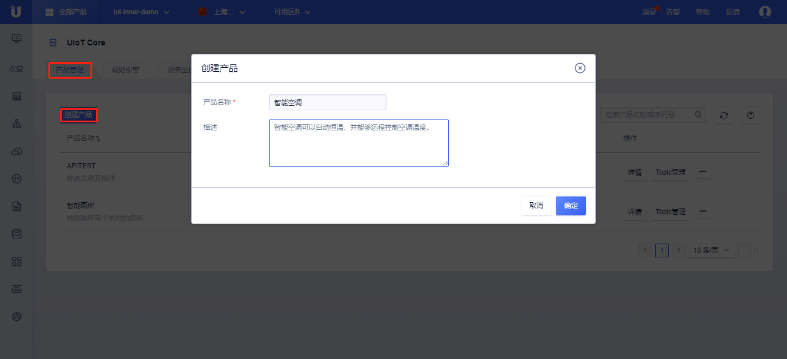

{{indexmenu_n>1}}

# 快速入门示例
为了快速的让您了解如何将您的设备连接到物联网平台，我们通过一个智能手环向云平台上报行走步数作为示例讲解。

## 操作步骤

### 创建产品与设备
将设备接入物联网平台的第一步是在平台[创建产品]()和[创建对应设备]()。产品相当于某一类设备的集合，该类设备具有相同的功能，您可以根据产品批量管理对应设备。

1. [注册](https://passport.ucloud.cn/#register)UCloud云服务
2. 登录进入UCloud[物联网平台](https://console.ucloud.cn/iot)
3. 创建产品  

   - 根据[创建产品]()文档说明及页面提示，点击<添加产品>，创建一个产品，命名为智能空调，点击<确定>；
   - 创建完成后，点击产品的详情，可以对产品进行相应的配置，具体参考[创建产品]()详细说明。

   

4. 创建设备

   - 根据[创建设备]()文档及页面提示，依次点击<产品详情>、点击<设备管理>、<添加设备>、<随机生成>、<生成设备个数1个>、<确定>；
   - 创建完成后，点击设备的详情，具体参考[创建设备]()详细说明。  

   


5. 记录设备注册信息  

   - 点击添加的设备，打开设备详情页，准备好设备注册相关信息，设备注册信息包含：`产品序列号` `设备序列号` `设备密码`，需要妥善保管好，后续测试需要使用。  

   


### 建立设备与平台的连接

这里使用平台提供的设备端C-SDK，从而快速将设备接入到物联网平台，详细参考[C-SDK使用参考]()。

在C-SDK的目录`sample/shadow/`通过修改例程`smart_bracelet_walk_step_shadow_sample.c`来介绍如何使用C-SDK。


#### 上行上报数据
该例程设备端通过linux环境进行模拟，上报'温度、湿度'到`自定义Topic /70ly1tvowt696r15/aruidyl0rt9tuvod/upload`。

1. 下载[设备端C-SDK]()，详细可以参考[C-SDK使用参考]()。
2. 修改代码`src/mqtt-example.c`

   - 修改设备密钥包含：`产品序列号` `设备序列号` `设备密码`

     >```
     >#define PRODUCTSN      ""
     >#define DEVICESN      ""
     >#define DEVICESECRET    ""
     >```

   - 修改订阅的topic

     >```
     >static int _register_subscribe_topics(void *client)
     >{
     >  static char topic_name[128] = {0};
     >  int size = HAL_Snprintf(topic_name, sizeof(topic_name), "/%s/%s/%s", UIOT_MY_PRODUCT_SN, UIOT_MY_DEVICE_SN, "upload");
     >  if (size < 0 || size > sizeof(topic_name) - 1)
     >  ...
     >}
     >```

   - 修改上行逻辑，逻辑会每隔5秒钟上报'温度、湿度'状态。

   >```
   >static int _publish_msg(void *client)
   >{
   >  ...
   >  char topic_content[MAX_SIZE_OF_TOPIC_CONTENT + 1] = {0};
   >  while(1){
   >    temperture = ...; //获取实时温度值
   >    humidity = ...;   //获取实时湿度值
   >    int size = HAL_Snprintf(topic_content, sizeof(topic_content), "{\"temperture\": \"%d\", \"humidity\": \"%d\"}", temperture, humidity);
   >    if (size < 0 || size > sizeof(topic_content) - 1)
   >    {
   >	   HAL_Printf("payload content length not enough! content size:%d  buf size:%d", size, (int)sizeof(topic_content));
   >	   return -3;
   >    }
   >    pub_params.payload = topic_content;
   >    pub_params.payload_len = strlen(topic_content);
   >    IOT_MQTT_Publish(client, topicName, &pub_params);
   >    IOT_MQTT_Yield(client,5000);
   >  }
   >  return ret;
   >}
   >```

	 注，实际开发中可以通过规则引擎将自定义Topic上发的数据流转到UHost/MQ/DB/TSDB等进行消费，详细参考[规则引擎]()。

3. 编译生成可执行文件`mqtt-example`

   >```
   >make clean
   >make
   >```

4. 执行可执行文件

   >```
   >./mqtt-example
   >```

5. 查看日志
   平台提供[监控日志与调试]()功能可以查看所有经过平台流转的上行或下行的数据。

   - 上行消息：上报到平台的数据

     通过Topic`/70ly1tvowt696r15/aruidyl0rt9tuvod/upload`上报的温度值；

	

	

#### 下行下发命令
下行通过调用云端开发API`PublishUIoTCoreMQTTMessage`下发需要设置的温度、湿度值到自定义Topic`/70ly1tvowt696r15/aruidyl0rt9tuvod/set`，设备端订阅该Topic即可收到相应的下发消息。具体参考[关于API接入]()。

1. 设备订阅Topic `/70ly1tvowt696r15/aruidyl0rt9tuvod/set`

2. 云端下发数据   
   UCloud API的调用可以通过GET或POST请求，这里以POST为例，参数中密钥、签名的使用参考[关于API接入]()，其他参数参考[PublishUIoTCoreMQTTMessage]()：

   >```
   >POST  HTTP/1.1
   >Host: api.ucloud.cn
   >Content-Type: application/json
   >Body:
   >{
   >	"Action": "PublishUIoTCoreMQTTMessage",
   >	"TopicFullName": "/70ly1tvowt696r15/aruidyl0rt9tuvod/set",
   >	"ProductSN": "70ly1tvowt696r15",
   >	"MessageContent": "eyJ0ZW1wZXJhdHVyZSI6MTUsImh1bWlkaXR5Ijo0NX0=", //base64Encode({"temperature":15,"humidity":45})
   >	"Qos": 1,
   >	"ProjectId": "org-z44lmf12e",
   >	"PublicKey": "CJf+LfjjXPk70z/fsBlK9sHC+kBTTj7gr2g/C/R7YSi3EFTK   Cmh7Bp5W1UH64D/O",
   >	"Region": "cn-sh2",
   >	"Signature": "f1e6b4e35df41b42232e059f6020c7fd51b2889e"
   >}
   >```

3. 云平台返回，表示调用成功

   >```
   >{
   > "RetCode": 0,
   > "Action": "PublishUIoTCoreMQTTMessageResponse"
   >}
   >```

4. 查看日志  
   平台提供[监控日志与调试]()功能可以查看所有经过平台流转的上行或下行的数据。

   - 下行消息：下发数据给设备  
     通过Topic`/70ly1tvowt696r15/aruidyl0rt9tuvod/set`下发需要设置的温度、湿度值；  


