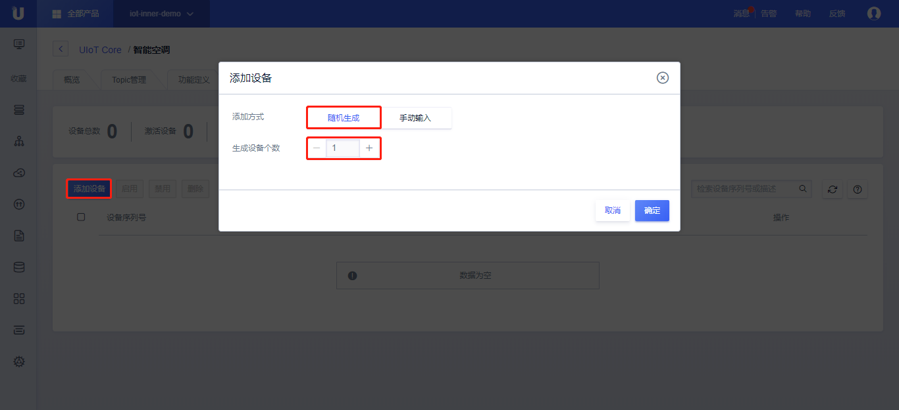
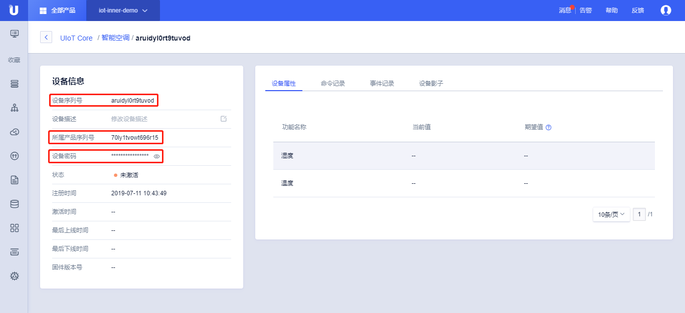
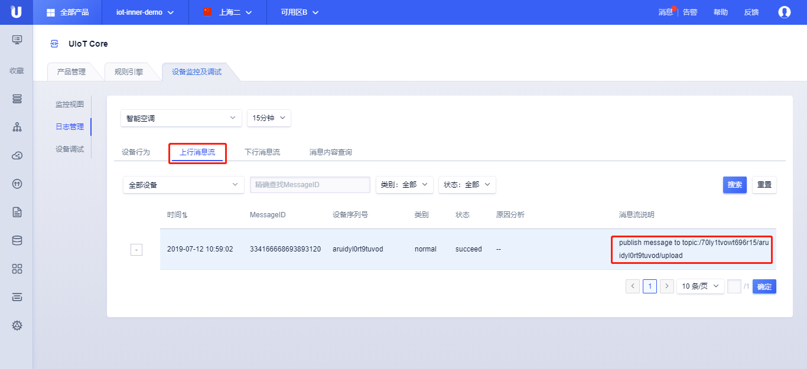
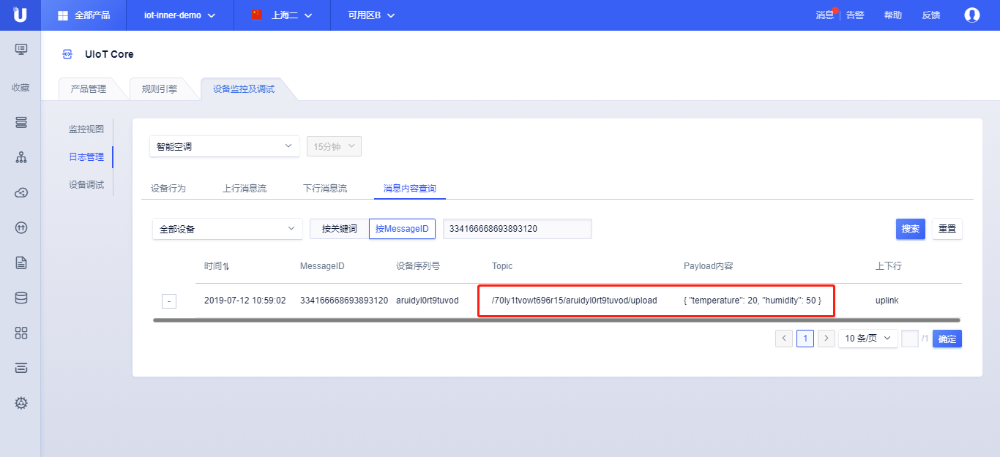
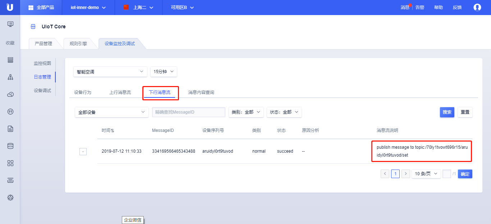
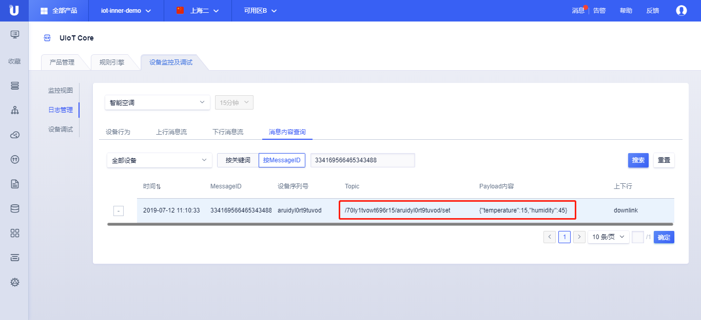

{{indexmenu_n>1}}

# 快速入门示例
为了快速的让您了解如何将您的设备连接到物联网平台，我们通过一个智能空调向云平台上报温度和湿度作为示例讲解。

## 操作步骤

### 创建产品与设备
将设备接入物联网平台的第一步是在平台[创建产品](../console_guide/product_device/create_products)和[创建对应设备](../console_guide/product_device/create_devcies)。产品相当于某一类设备的集合，该类设备具有相同的功能，您可以根据产品批量管理对应设备。

1. [注册](https://passport.ucloud.cn/#register)UCloud云服务
2. 登录进入UCloud[物联网平台](https://console.ucloud.cn/uiot)
3. 创建产品  

   - 根据[创建产品](../console_guide/product_device/create_products)文档说明及页面提示，点击<创建产品>，创建一个产品，命名为智能空调，点击<确定>；
   - 创建完成后，点击产品的详情，可以对产品进行相应的配置，具体参考[创建产品](../console_guide/product_device/create_products)详细说明。
   
   

4. 创建设备

   - 根据[创建设备](../console_guide/product_device/create_devcies)文档及页面提示，依次点击<详情>、点击<设备管理>、<添加设备>、<随机生成>、<生成设备个数1个>、<确定>；
   - 创建完成后，点击设备的详情，具体参考[创建设备](../console_guide/product_device/create_devcies)详细说明。  
   
   


5. 记录设备注册信息  
 
   - 点击添加的设备，打开设备详情页，准备好设备注册相关信息，设备注册信息包含：`产品序列号` `设备序列号` `设备密码`，需要妥善保管好，后续测试需要使用。  
   
   


### 建立设备与平台的连接

这里使用平台提供的设备端C-SDK，从而快速将设备接入到物联网平台，详细参考[C-SDK使用参考](../device_develop_guide/c_sdk_example/csdkquickstart)。

在C-SDK的目录`sample/mqtt/`通过修改例程`mqtt_sample.c`来与云平台进行通信。


#### 上行上报数据
该例程设备端通过linux环境进行模拟，上报'温度、湿度'到`自定义Topic /70ly1tvowt696r15/aruidyl0rt9tuvod/upload`。

1. 下载[设备端C-SDK](https://github.com/ucloud/ucloud-iot-device-sdk-c)，详细可以参考[C-SDK使用参考](../device_develop_guide/c_sdk_example/csdkquickstart)。

2. 修改代码`sample/mqtt/mqtt_sample.c`

   - 修改设备密钥包含：`产品序列号` `设备序列号` `设备密码`
   
     ```
     #define UIOT_MY_PRODUCT_SN      "70ly1tvowt696r15"     //修改为需要测试的产品序列号
     #define UIOT_MY_DEVICE_SN      "aruidyl0rt9tuvod"      //修改为需要测试的设备序列号
     #define UIOT_MY_DEVICE_SECRET    "imwku9r4jy7jwcip"    //修改为需要测试的设备密码
     ...
     //static int sg_count = 0;   // 注释该行，替换成温度和湿度变量
     static int temperture = 0; //添加温度值变量
     static int humidity = 0;   //添加湿度值变量
     static int sg_sub_packet_id = -1;
     ...
     ```
   
   - 修改需要订阅的topic名称

     ```
     static int _register_subscribe_topics(void *client)
     {
       static char topic_name[128] = {0};
       // 修改topic名称
       int size = HAL_Snprintf(topic_name, sizeof(topic_name), "/%s/%s/%s", UIOT_MY_PRODUCT_SN, UIOT_MY_DEVICE_SN, "set");
       if (size < 0 || size > sizeof(topic_name) - 1)
       ...
     }
     ```

   - 找到publish函数，修改消息上报的topic和消息内容格式。

     ```
     static int _publish_msg(void *client)
     {
       char topicName[128] = {0};
       
       //修改topic名称
       HAL_Snprintf(topicName, 128, "/%s/%s/%s", UIOT_MY_PRODUCT_SN, UIOT_MY_DEVICE_SN, "upload");
     
       PublishParams pub_params = DEFAULT_PUB_PARAMS;
       pub_params.qos = QOS1;
     
       char topic_content[MAX_SIZE_OF_TOPIC_CONTENT + 1] = {0};
       
       //添加上报属性值
       temperture = 15; //设置上报温度值
       humidity = 45;   //设置上报湿度值
       
       //修改上报内容和组包格式
       int size = HAL_Snprintf(topic_content, sizeof(topic_content), "{\"temperture\": \"%d\", \"humidity\": \"%d\"}", temperture, humidity);
       
       if (size < 0 || size > sizeof(topic_content) - 1)
       ...
     }
     ```

   - 找到main函数，修改上报频次，每隔5秒钟上报'温度、湿度'状态。

     ```
     int main(int argc, char **argv) {
       ...
     	//register subscribe topics here
       rc = _register_subscribe_topics(client);
       if (rc < 0) {
         HAL_Printf("Client Subscribe Topic Failed: %d", rc);
         return rc;
       }
     
       rc = IOT_MQTT_Yield(client, 200);
     
       do {
         // 等待订阅结果
         if (sg_sub_packet_id > 0) {
           HAL_Printf("subscribe topic success!");
          
            while(1){
              rc = _publish_msg(client);
              if (rc < 0) {
                HAL_Printf("client publish topic failed :%d.", rc);
              }
     		 //修改上报频次，每隔5秒发送当前温度值和湿度值
              rc = IOT_MQTT_Yield(client, 5000);
            }
     	}
       }while (sg_sub_packet_id < 0);
     
       rc = IOT_MQTT_Destroy(&client);    
       return rc;
     }
     ```

     注：实际开发中可以通过规则引擎将自定义Topic上发的数据流转到UHost/MQ/MySQL等进行消费，详细参考[规则引擎](../console_guide/ruleengine/data_forwarding)。

3. 编译生成可执行文件`mqtt_sample`

     ```
     make clean
     make
     ```

4. 执行可执行文件

     ```
     ./output/release/bin/mqtt_sample
     ```

5. 查看日志

     平台提供[日志管理](../console_guide/monitoring_maintenance/log)功能可以查看所有经过平台流转的上行或下行的数据。
     
     - 上行消息：上报到平台的数据
     
       通过Topic**/70ly1tvowt696r15/aruidyl0rt9tuvod/upload**上报的温度值；
     
       
     
        

#### 下行下发命令

下行通过调用云端开发API`PublishUIoTCoreMQTTMessage`下发需要设置的温度、湿度值到自定义Topic`/70ly1tvowt696r15/aruidyl0rt9tuvod/set`，设备端订阅该Topic即可收到相应的下发消息。

具体参考[关于API接入](../api_guide/api_guidehelp)。

1. 设备订阅Topic `/70ly1tvowt696r15/aruidyl0rt9tuvod/set`

2. 云端下发数据   

     UCloud API的调用可以通过GET或POST请求，这里以POST为例，参数中密钥、签名的使用参考[关于API接入](../api_guide/api_guidehelp)，其他参数参考[PublishUIoTCoreMQTTMessage](../api_guide/messagemgmtapi)：

     ```
     POST  HTTP/1.1
     Host: api.ucloud.cn
     Content-Type: application/json
     Body:
     {
     	"Action": "PublishUIoTCoreMQTTMessage",
     	"TopicFullName": "/70ly1tvowt696r15/aruidyl0rt9tuvod/set",
     	"ProductSN": "70ly1tvowt696r15",
     	"MessageContent": "eyJ0ZW1wZXJhdHVyZSI6MTUsImh1bWlkaXR5Ijo0NX0=", //base64Encode({"temperature":15,"humidity":45})
     	"Qos": 1,
     	"ProjectId": "org-z44lmf12e",
     	"PublicKey": "CJf+LfjjXPk70z/fsBlK9sHC+kBTTj7gr2g/C/R7YSi3EFTK   Cmh7Bp5W1UH64D/O",
     	"Region": "cn-sh2",
     	"Signature": "f1e6b4e35df41b42232e059f6020c7fd51b2889e"
     }
     ```

3. 云平台返回，表示调用成功

     ```
     {
      "RetCode": 0,
      "Action": "PublishUIoTCoreMQTTMessageResponse"
     }
     ```

4. 查看日志  

     平台提供[日志管理](../console_guide/monitoring_maintenance/log)功能可以查看所有经过平台流转的上行或下行的数据。

     - 下行消息：下发数据给设备  
        通过Topic**/70ly1tvowt696r15/aruidyl0rt9tuvod/set**下发需要设置的温度、湿度值；  


       

       
