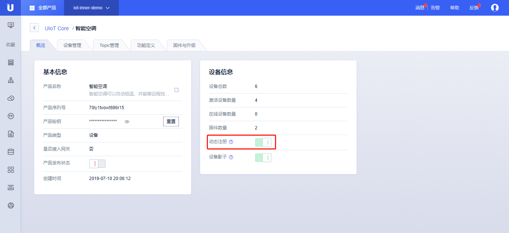

{{indexmenu_n>3}}

# 动态注册（需要修改补充预认证说明）
动态注册也叫做一型一密，也就是说同一个产品下的设备激活时使用产品公共的凭证（`产品序列号`，`产品密码`）。 然后物联网平台给设备下发`设备密码`，设备保存`设备密码`，然后使用拿到的密码按照静态注册的流程完成激活认证。      

## 操作步骤：
1. 参考[云平台操作指南]()，[创建产品]()，[动态注册设备]()，打开<动态注册>开关；
2. 准备工作：
   1. 开发设备端固件，使用[SDK动态注册]()开发相应的固件；
   2. 确认产品详情页的<动态注册>开关已经打开；
3. 将步骤2开发的固件直接发给产线烧录；
4. 设备首次连接云平台，通过产品公共凭证（`产品序列号`，`产品密码`）及自定义`设备序列号`进行设备预认证。
5. 预认证通过后，设备可以接入物联网平台，但是此时权限受限，设备需要获取`设备密码`接入云平台才能正常使用平台功能。  
设备获取`设备密码`方法为：  
设备向Topic`/$system/${ProductSN}/${DeviceSN}/password`发送一条请求获取密码消息(RequestID任意指定)：
   
   ```
   {
   	"RequestID": "100"
   }
   ```
   云平台收到请求后会将`设备密码`通过Topic `/$system/${ProductSN}/${DeviceSN}/password_reply`下发给设备，消息格式为：
   ```
   {
    "RetCode": "0", 
   	"RequestID": "100",
   	"Password": "the device secret"
   }
   ```
6. 设备通过收到的`设备密码`，以[静态注册]()的方式完成激活认证。

注：动态注册需要用户预先在平台<批量生成>或<手动添加>设备序列号，设备进行预认证上报设备序列号时，平台会进行校验，只有校验通过后才会下发设备密码。




## 具体流程：
生成动态MQTT Broker认证需要的三要素：`ClientID`，`UserName`，`Password`。
1. 获取到产品的公共凭证（`产品序列号`，`产品密码`），分别表示为`${ProductSN}`，`${ProdSecret}`；
2. 设备自定义`${DeviceSN}`，比如可以选取设备的MAC地址、IMEI或者SN等作为`${DeviceSN}`。
3. 通过以下规则生成MQTTBroker认证的三要素；

MQTT认证三要素| 生成规则
---|---
ClientID | ${ProductSN}.${DeviceSN}<br>举例：70ly1tvowt696r15.112233445566
UserName | ${ProductSN}\|${DeviceSN}\|${authmode}<br>举例：70ly1tvowt696r15\|112233445566\|2<br>authmode: 1 表示静态注册；2表示动态注册
Password | ${ProdSecret}<br>举例：sqx0cltqba402z7z

4. 预认证成功后，订阅Topic `/$system/${ProductSN}/${DeviceSN}/password_reply`，举例：`/$system/70ly1tvowt696r15/112233445566/password_reply`；
5. 发送请求获取密码消息
   ```
   Publish /$system/${ProductSN}/${DeviceSN}/password
   举例： /$system/70ly1tvowt696r15/112233445566/password
   
   {
   	"RequestID": "100"
   }
   ```
   云平台将`设备密码`通过步骤4订阅的Topic下发，举例收到的`设备密码`为`zlc3d21u5k8fq0d2`；
   ```
   Subscribe /$system/${ProductSN}/${DeviceSN}/password_reply
   举例： /$system/70ly1tvowt696r15/112233445566/password_reply
   
   {
    "RetCode": "0", 
   	"RequestID": "100",
   	"Password": "zlc3d21u5k8fq0d2"
   }
   ```
6. 通过静态注册的规则生成新的MQTTBroker认证的三要素：

   MQTT认证三要素| 生成规则
   ---|---
   ClientID | ${ProductSN}.${DeviceSN}<br>举例：70ly1tvowt696r15.112233445566
   UserName | ${ProductSN}\|${DeviceSN}\|${authmode}<br>举例：70ly1tvowt696r15\|112233445566\|1<br>authmode: 1 表示静态注册；2表示动态注册
   Password | ${DevSecret}<br>举例：zlc3d21u5k8fq0d2

5. 参考[下一节设备连接]()将设备接入到物联网平台，完成认证；


